Martin Frigaard’s Github Profile
================

Below is a list of my code repositories and various data projects.

## [Storybench Tutorials](https://github.com/mjfrigaard/storybench-posts)

These are tutorials I’ve written for the Data Journalism in R section on
[Storybench.org](http://www.storybench.org/author/martinfri/).

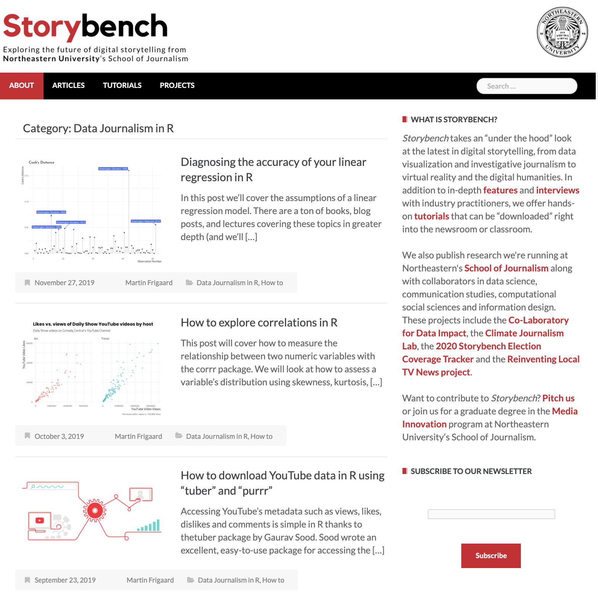<!-- -->

## Blood Glucose Monitor [Shiny Application](https://mjfrigaard.github.io/seg-shiny-v-1-3-1/)

I built a Shiny web application for the [Diabetes Technology
Society](https://www.diabetestechnology.org/index.shtml). The
application is based on [this
study](https://www.diabetestechnology.org/seg.shtml), and it uses an
error grid to assess the clinical risk from inaccurate blood glucose
monitors.

  - Check out the application
    [here](https://www.diabetestechnology.org/seg/)

  - The application lets clinician and researchers upload a .csv file of
    blood glucose measurements (see below)

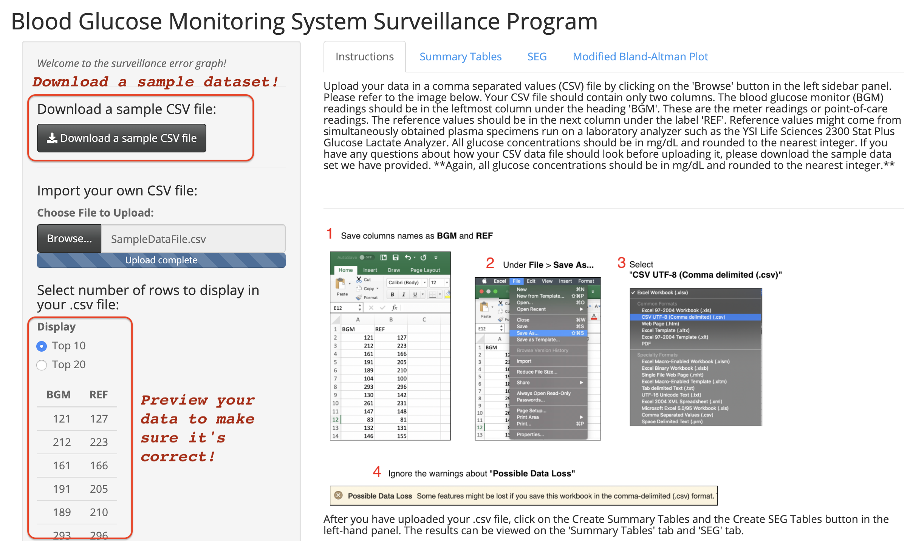<!-- -->

  - The full technical description of the project is
    [here](https://journals.sagepub.com/doi/pdf/10.1177/1932296814539589)

  - The summary tables include the categorical breakdown of the BGM
    (blood glucose monitor) and REF (reference values) comparisons. It
    also calculates the [Mean Absolute Relative Difference
    (MARD)](https://journals.sagepub.com/doi/full/10.1177/1932296816644468).

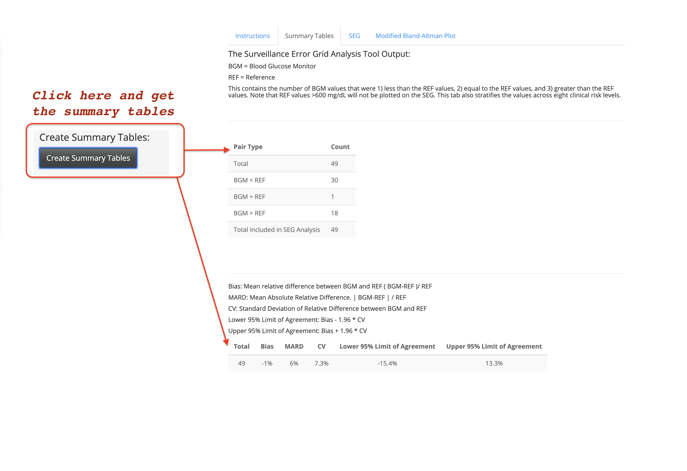<!-- -->

It also tallies the number of BGM and REF pairs in each Risk Grade (A,
B, C, D, E), and the number of pairs in the SEG Risk Categories.

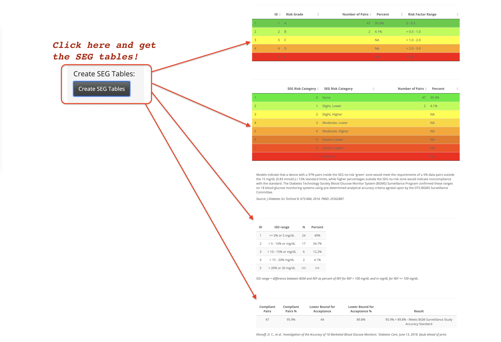<!-- -->

  - the **SEG** panel plots the data in the heatmap developed in [this
    research
    paper](https://journals.sagepub.com/doi/full/10.1177/1932296814539590).

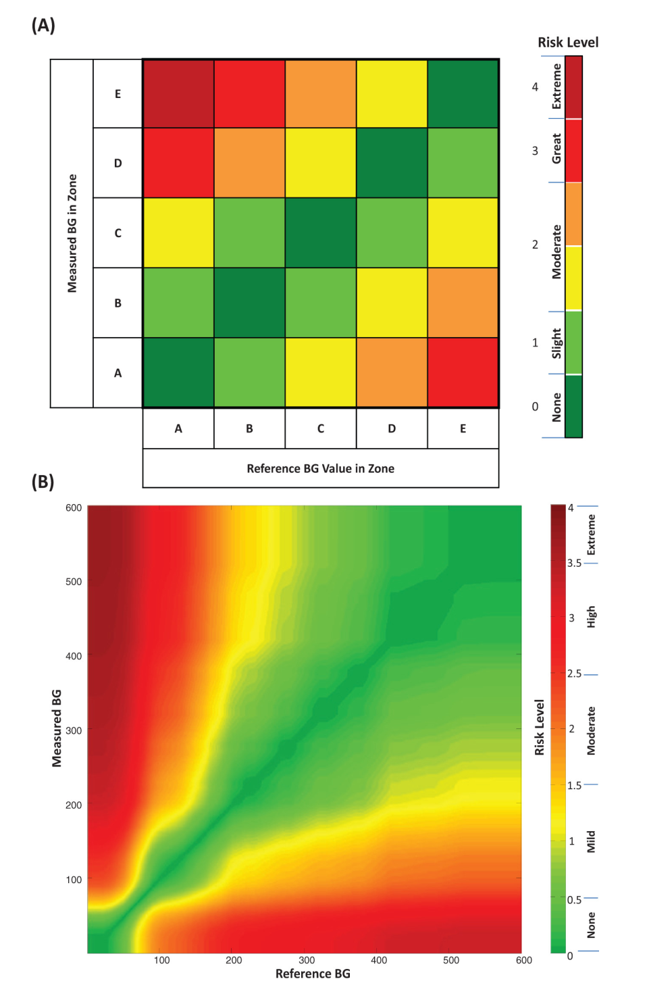<!-- -->

I wrote a quick how-to on adding this [Gaussian smoothed image into a
`ggplot2` layer](https://mjfrigaard.github.io/seg-ggplot2/)

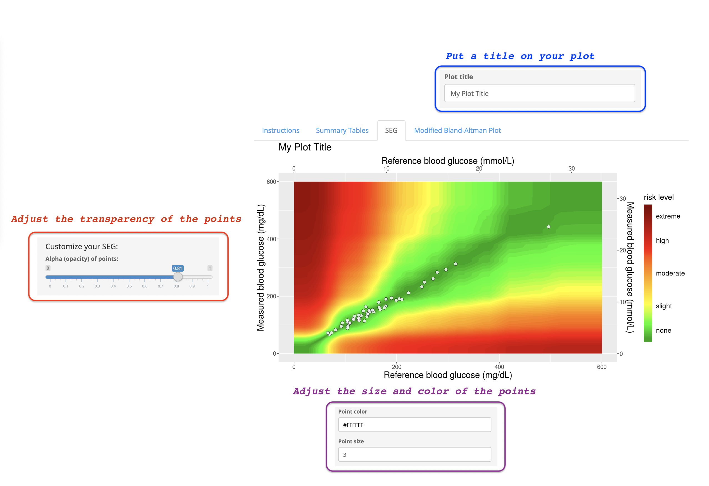<!-- -->

The application also has the ability to download the modified
Bland-Altman plot.

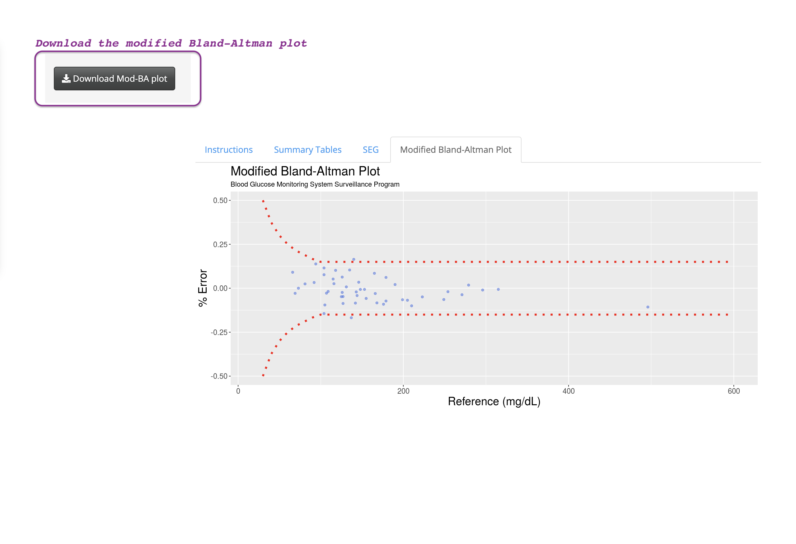<!-- -->

## This is the [don’t mess with Texas](https://mjfrigaard.github.io/dont-mess-with-texas/) project

These data come from the [Texas Department of Criminal
Justice](https://www.tdcj.texas.gov/index.html) website that holds death
row information on executed
[offenders](https://www.tdcj.texas.gov/death_row/dr_executed_offenders.html).

The information on the offenders are stored in the .jpgs (like the one
below).

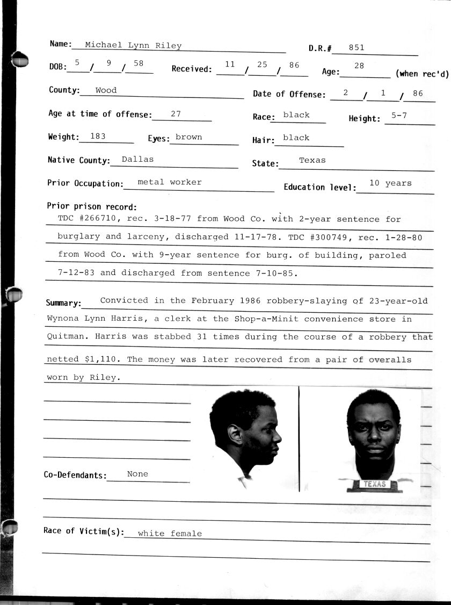<!-- -->

I used
[`purrr::walk2()`](https://purrr.tidyverse.org/reference/map2.html) to
download these files (see image below):

<!-- -->

## [Sharing your work](https://leanpub.com/showingyourwork)

This is a book that covers RStudio.Cloud, Git, and Github. The repo is
[here](https://github.com/mjfrigaard/sharing-your-work). Some of the
images from the chapters are below:

Rmarkdown workflows.

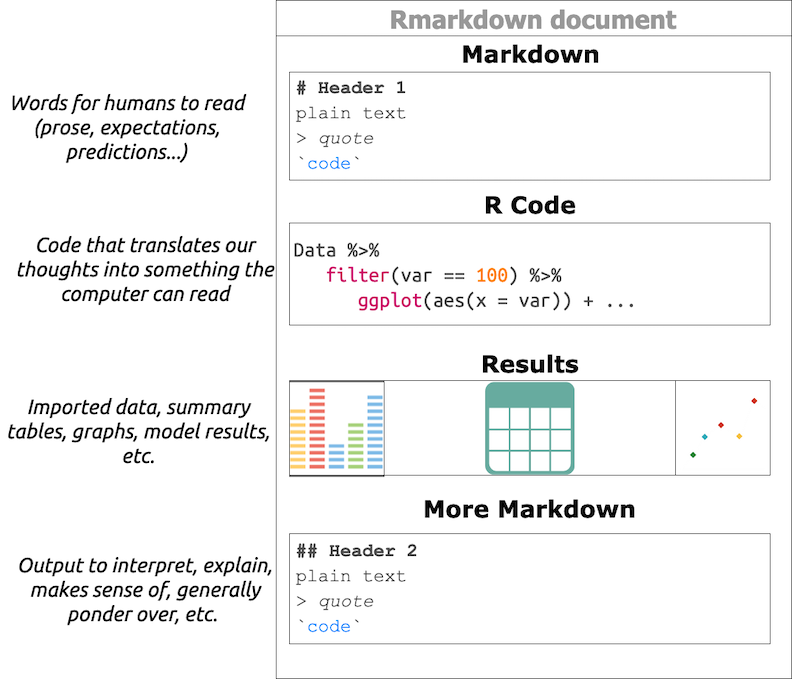<!-- -->

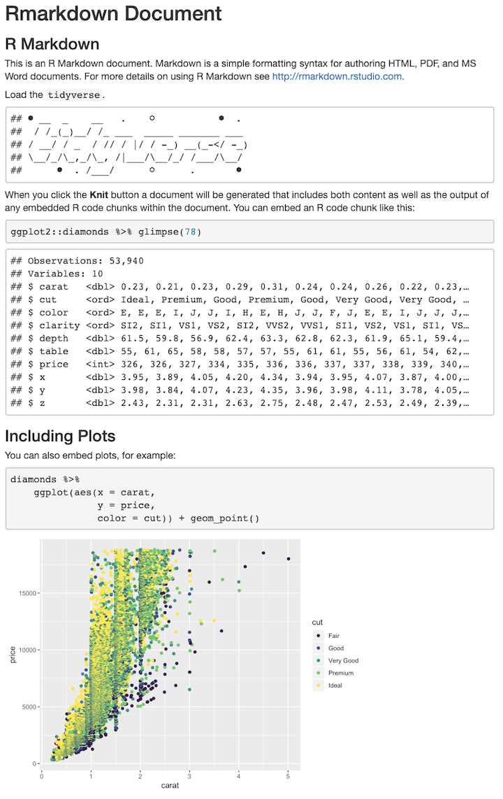<!-- -->

Git and Github.

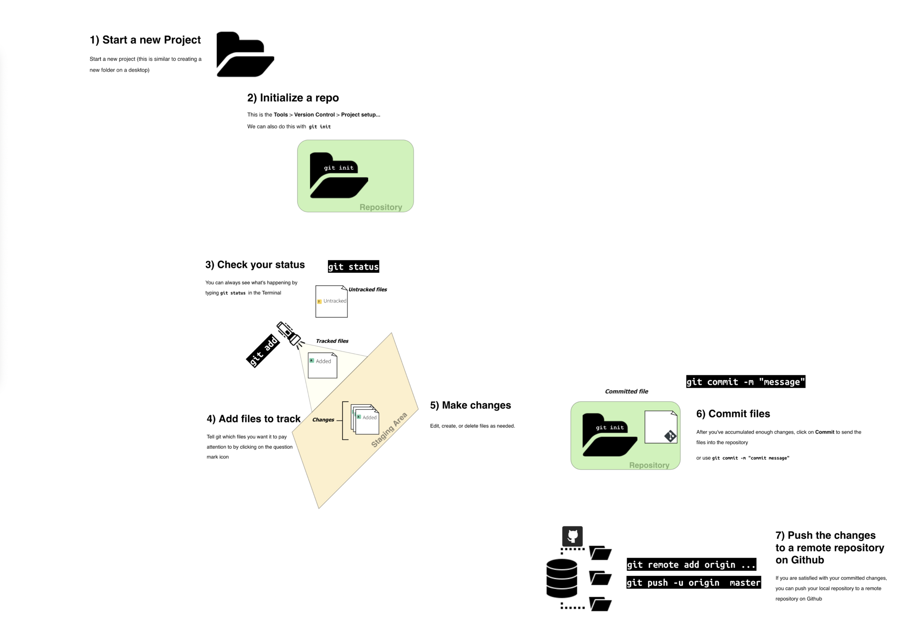<!-- -->

## Handshake application

This is the handshake application for identifying colleges.
