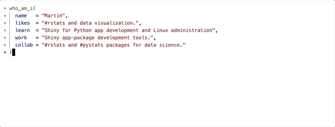
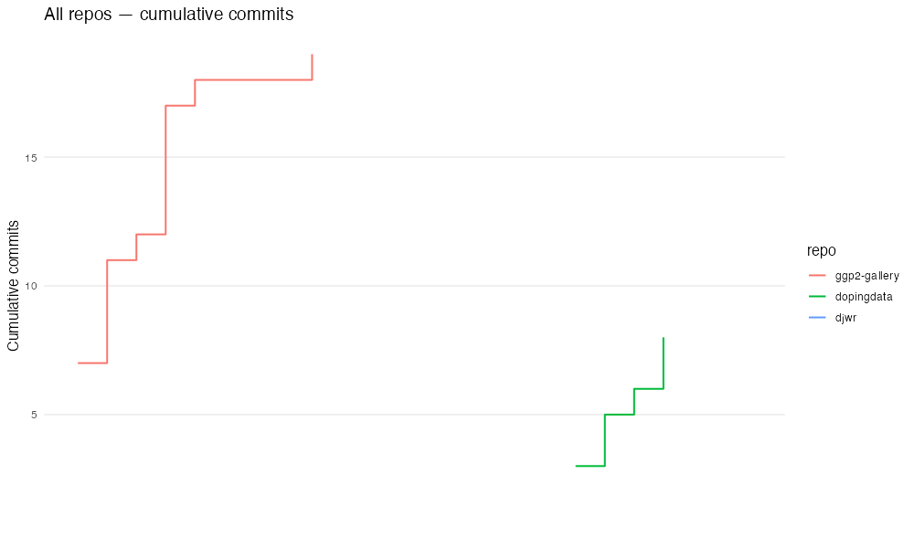
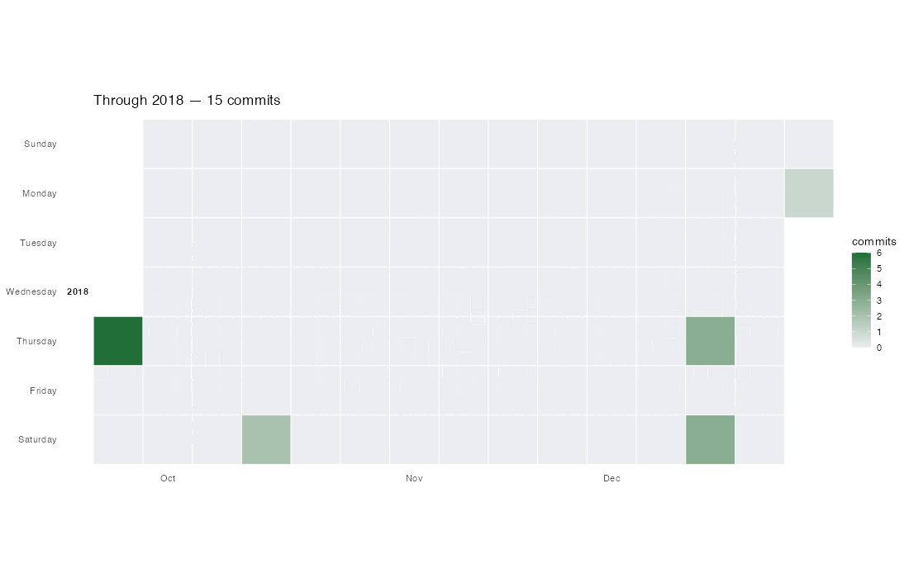
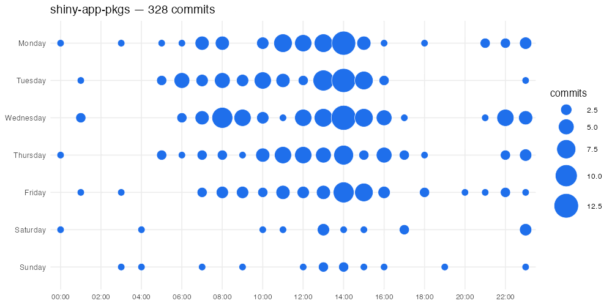

```{r}
#| label: setup
#| eval: true 
#| echo: false 
#| include: false
source("../_common.R")
options(
  scipen = 999,
  repos = c(pm = "https://packagemanager.posit.co/cran/latest",
            CRAN = "https://cloud.r-project.org")
  )
library(quarto)
library(rmarkdown)
library(shiny)
library(lobstr)
```

```{r}
#| label: co_box_dev
#| echo: false
#| results: asis
#| eval: false
co_box(color = "r", 
  header = "DRAFT!", 
  contents = "This post is currently under development--thank you for your patience.")
```

GitHub `README` files allow users to introduce themselves, share interests, projects, status, etc.[^gh-readme-reqs] I love working in RMarkdown, so I wrote a small package that allows me to update my profile `README` with badges and `ggplot2` graphs. I'll walk through the workflow in this post. 

[^gh-readme-reqs]: Read more about [GitHub README prerequisites](https://docs.github.com/en/account-and-profile/how-tos/profile-customization/managing-your-profile-readme#prerequisites)

Install the package from GitHub: 

```{r}
#| eval: false
#| code-fold: false 
install.packages('remotes')
remotes::install_github("mjfrigaard/ghreadme")
```


```{r}
#| eval: true
#| code-fold: false 
library(ghreadme)
```

Create a new RMarkdown `README.Rmd` file with the `use_profile_readme()` function: 

```{r}
#| eval: false
#| code-fold: false
use_profile_readme(
  name     = "Martin",
  likes    = "#rstats and data visualization.",
  learn    = "Shiny app development, Python, and Linux",
  work     = "R package development tools.",
  collab   = "#rstats packages for data science.",
  username = "mjfrigaard"
)
```

Use `overwrite = TRUE` to replace the existing file.

```{bash}
#| eval: false
#| code-fold: false
✔ Wrote ./README.Rmd
ℹ Edit the placeholders, then knit to regenerate README.md.
```

## Introduce yourself

The [`who_am_i()`](https://mjfrigaard.github.io/ghreadme/reference/who_am_i.html) function can be used to create a .gif of your likes, what you're currently learning/working on, and how you'd like to connect. 

{width='100%' fig-align='center'}

## Collecting Git info

You can collect your Git info with the `collect_git_commits()` function. `include` can also provide commits, stars, issues, and PRs.

```{r}
#| label: keep-collect_git_commits
#| eval: false
#| include: false
stats <- collect_git_commits(
  user    = "mjfrigaard",
  emails = c("mjfrigaard@pm.me", "mjfrigaard@gmail.com"),
  include = c("commits", "stars", "issues", "prs")
)
```

```{r}
#| label: read-collect_git_commits
#| eval: true
#| include: false
stats <- readRDS(file = "2026-06-03-stats.rds")
```

```{r}
#| label: collect_git_commits
#| eval: false
#| code-fold: false
stats <- collect_git_commits(
  user    = "your-username",
  emails  = "you@example.com",
  include = c("commits", "stars", "issues", "prs")
)
```

A list with four `tibble`s is returned. Once you have your Git information, you can create graphs for your `README`. 

```{r}
#| label: names-stats
#| eval: true
#| code-fold: false
names(stats)
```

### Commits 

Probably the most interesting data is the `commits` dataset:

```{r}
#| label: commits
#| eval: true 
#| code-fold: false
str(stats$commits)
```

I've included functions in `ghreadme` for quickly making graphs to visualize your commits. 

#### Cumulative Line Plot

`cumulative_line_plot()` creates a line graph of the cumulative commits over time per repo: 

```{r}
#| eval: true 
#| code-fold: false
library(ggplot2)

cumulative_line_plot(
  stats$commits,
  repo = NULL,
  date_begin = "2023-01-01",
  date_end = "2026-06-01",
  top_n = 10,
  show_other = TRUE,
  title = "Cumulative Line Plot"
)
```


#### Calendar Heatmap Plot

`calendar_heatmap_plot()` creates a heatmap similar to the GitHub heatmap, and allows us to facet by year. 

```{r}
#| eval: true 
#| code-fold: false
calendar_heatmap_plot(
  stats$commits,
  repo = NULL,
  date_begin = "2023-01-01",
  date_end = "2026-06-01",
  title = "Calendar Heatmap",
  week_start = c("Sunday", "Monday"),
  low = "#ebedf0",
  high = "#216e39"
)
```


#### Punch Card Plot

`punchcard_plot()` lets you view the time of day your commits occur:

```{r}
#| eval: true 
#| code-fold: false
punchcard_plot(
  stats$commits,
  repo = NULL,
  date_begin = "2023-01-01",
  date_end = "2026-06-01",
  title = "Punchcard Plot",
  point_color = "#1f6feb"
)
```

### Stars 

The `stars` data has similar structure to the `commits`:

```{r}
#| label: stars
#| eval: true 
#| code-fold: false
str(stats$stars)
```

#### Top 10 repos by stars

Below is a "Top 10 repos by stars" bar graph using `stargazers_count` and `repo`:

```{r}
#| label: top-10-repos-by-stars
#| eval: true
#| code-fold: false
stats$stars |>
  head(10) |>
  ggplot(aes(
    x = stargazers_count,
    y = reorder(repo, stargazers_count)
  )) +
  geom_col(fill = "#1E5F8C") +
  labs(
    x = "Stars",
    y = NULL,
    title = "Top 10 repos by stars"
  ) +
  theme_minimal()
```

### Issues 

```{r}
#| label: issues
#| eval: true 
#| code-fold: false
str(stats$issues)
```

#### Issues per year (by state)

Table outputs are also great for your README. Below is a "issues opened per year, by state” summary:

```{r}
#| eval: true 
#| code-fold: false
stats$issues |>
  dplyr::mutate(
    year = as.integer(format(created_at, "%Y"))
    ) |>
  dplyr::count(year, state) |>
  tidyr::pivot_wider(
    names_from = state, 
    values_from = n, 
    values_fill = 0) |> 
  dplyr::arrange(dplyr::desc(year)) |> 
  gt::gt() |> 
  gt::tab_header(
    title = "Issues opened per year", 
    subtitle = "By state")
```

### Creating .gifs

For changes over time, you can use the recipes in the [visualization vignette](https://mjfrigaard.github.io/ghreadme/articles/viz-git-gif.html) to create animated .gifs. I've included examples below. 

{width='100%' fig-align='center'}

{width='100%' fig-align='center'}

{width='100%' fig-align='center'}


Check out the package documentation for more updates! 