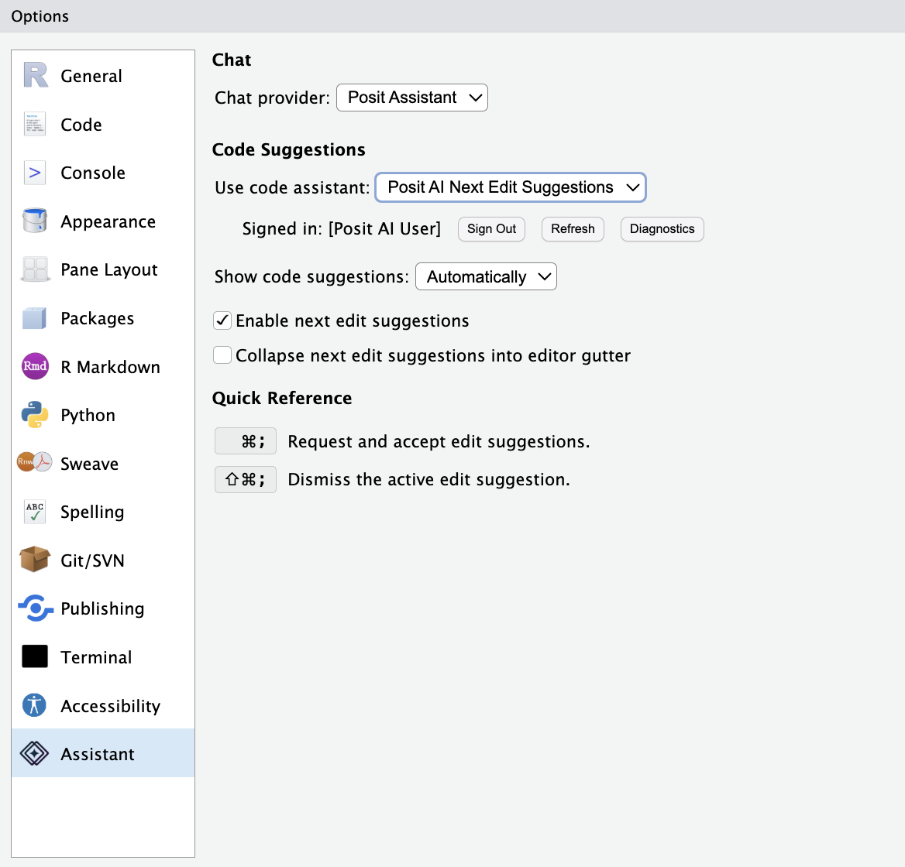
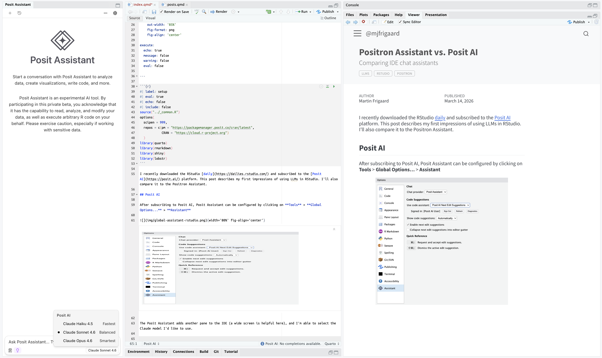

```{r}
#| label: setup
#| eval: true 
#| echo: false 
#| include: false
source("../_common.R")
options(
  scipen = 999,
  repos = c(pm = "https://packagemanager.posit.co/cran/latest",
            CRAN = "https://cloud.r-project.org")
  )
library(quarto)
library(rmarkdown)
library(shiny)
library(lobstr)
```

I recently downloaded the RStudio [daily](https://dailies.rstudio.com/) and subscribed to the [Posit AI](https://posit.ai/) platform. This post describes my first impressions of using LLMs in RStudio. I'll also compare it to the Positron Assistant. 

## Posit AI

After subscribing to Posit AI, Posit Assistant can be configured by clicking on **Tools** > **Global Options...** > **Assistant** 

{width='80%' fig-align='center'}

The Posit Assistant adds another pane to the IDE (a wide screen is helpful here), and I'm able to select the Claude model I'd like to use:

{width='100%' fig-align='center'}


