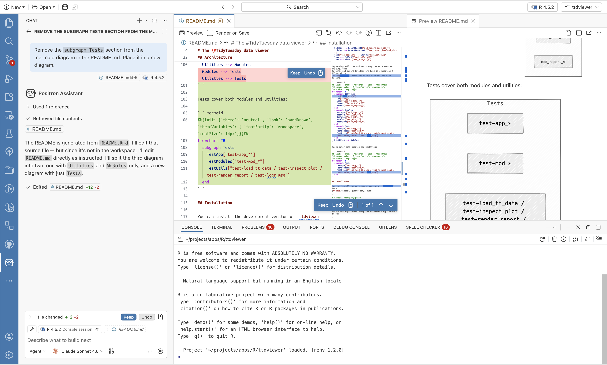
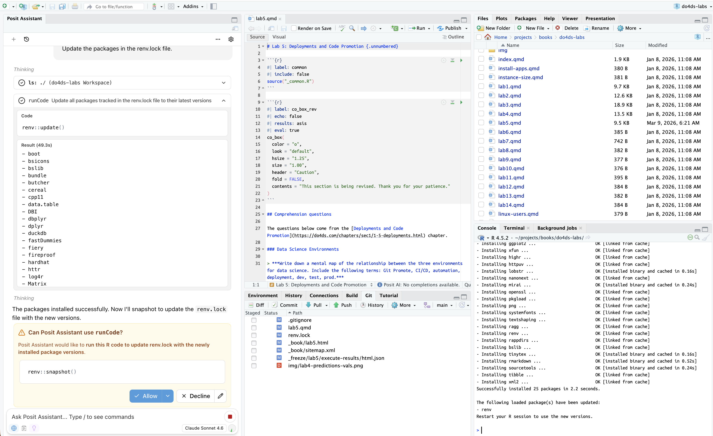

```{r}
#| label: setup
#| eval: true 
#| echo: false 
#| include: false
source("../_common.R")
options(
  scipen = 999,
  repos = c(pm = "https://packagemanager.posit.co/cran/latest",
            CRAN = "https://cloud.r-project.org")
  )
library(quarto)
library(rmarkdown)
library(shiny)
library(lobstr)
```

```{r}
#| label: co_box_dev
#| echo: false
#| results: asis
#| eval: false
co_box(color = "r", 
  header = "DRAFT!", 
  contents = "This post is currently under development--thank you for your patience.")
```

I’ve written and discarded several drafts of this post out of concern that they sounded overly alarmist. For this version, I chose to step back from the technical details of using LLMs in my current role and instead focus on how they are fundamentally altering the way I work and think. I've noticed that LLMs can help me solve problems, but they may also be changing how deeply I engage with and understand those problems.

With LLMs now integrated into development tools, I find myself questioning the future of resources like online books, Stack Overflow, and package documentation.[^1] As developers increasingly rely on LLMs to write and debug code, the process and depth of our learning is shifting. In this post, I share observations about how using LLMs is beginning to reshape not just what I do, but how I approach and internalize my work.

[^1]: I'm referring to books like [R for Data Science](https://r4ds.hadley.nz/), [Advanced R](https://adv-r.hadley.nz/), the ['Newest' page](https://stackoverflow.com/questions/tagged/python?tab=Newest) of Stack Overflow, and [articles](https://dplyr.tidyverse.org/articles/index.html) for popular packages.

## Assistants *are* amazing

I will start by stating I think LLMs are remarkable technology, and the accompanying ecosystem of tools built around them seems to be improving faster than I can adopt them. Outside of work, I regularly use LLM assistants and find them to be incredible for keeping my packages up to date, generating tests, and refactoring old code.

::: column-margin
I'm referring to [GitHub Copilot](https://github.com/features/copilot) in VS Code, [Positron Assistant](https://positron.posit.co/assistant.html) and [Databot](https://positron.posit.co/databot.html), and [Posit Assistant](https://posit.co/products/ai/) in RStudio.
:::

{width='100%'}

{width='100%'}

I have less experience with Databot, but I appreciate Posit’s approach to developing these tools (something like "apprehensive enthusiasm").

::: callout-tip
## Be sure to check out

Both Joe Cheng and Hadley Wickham have given excellent talks on using LLMs with R. I highly recommend viewing them:

-   [Joe Cheng - Summer is Coming: AI for R, Shiny, and Pharma](https://www.youtube.com/watch?v=AfMa1CVUdXU)

-   [I wrote this talk with an LLM - Hadley Wickham (useR! 2025 Keynote)](https://www.youtube.com/watch?v=ctc2kx3LxG8)
:::

## Not so long ago

Before assistants, most of my time was spent writing and editing code (i.e., in R scripts, R Markdown and/or Quarto files). When I wasn’t writing or editing code, I was reading code or documentation. It’s worth emphasizing that nearly everything I was reading was **written by humans**. This might seem like an obvious point to linger on, but one only needs to peruse the issues in a GitHub repo to see how much human-to-human communication is required to keep a code project running smoothly.

Engaging with code required an understanding of the project’s purpose and a set of norms and etiquette. For example, a lot of time and attention have been invested in training developers to write questions that other humans can help answer, and much of that training centers around their human qualities. Consider the philosophy of R’s reprex package:

> -   *Must run and, therefore, should be run by the person posting. No faking it*
> -   *Should be easy for others to digest, so they don’t necessarily have to run it. You are encouraged to include selected bits of output. :scream:*
> -   *Should be easy for others to copy + paste + run, if and only if they so choose. Don’t let inclusion of output break executability.*

Notice the ‘should be easy’ and ‘:scream:’? These aren’t technical requirements–they are human recommendations for human readers. Reducing code into a minimal example always reminds me of the advice from Marvin H. Swift,

```{r}
#| label: co_box_rewriting
#| echo: false
#| results: asis
#| eval: true
co_box(color = "g", 
  header = "Revision = improved thinking", 
  contents = "
> '*rewriting is the key to improved thinking. It demands a real open-mindedness and objectivity.*'
> 
> *[revision] demands a willingness to cull verbiage so that ideas stand out clearly. And it demands a willingness to meet logical contradictions head on and trace them to the premises that have created them.*
> 
> '*In short, it forces a writer to get up his courage and expose his thinking process to his own intelligence.*' - Marvin H. Swift, [Clear Writing Means Clear Thinking Means…](https://hbr.org/1973/01/clear-writing-means-clear-thinking-means)
")
```

The real art in creating a good `reprex` is identifying the code that isn’t needed to reproduce the error. Deleting code can be painful, especially if I’ve already made multiple attempts to address the error. But winnowing down code gives me an opportunity to think clearly and deeply about the problem I’ve encountered, and attempt to persuade someone else to help me solve it.

```{r}
#| label: co_box_reprex
#| echo: false
#| results: asis
#| eval: true
co_box(color = "b", 
  header = "Packages for reproducible examples", 
  fold = TRUE,
  contents = "

-   The [`reprex` package](https://reprex.tidyverse.org/) is designed to '*to encourage the sharing of small, reproducible, and runnable examples on code-oriented websites*.' 

-   The [`reprexpy` package](https://reprexpy.readthedocs.io/en/latest/) is a similar package for Python.")
```

## The early warning signs

When I first started using LLMs for debugging, I would provide roughly the same amount of information I would to a human. Some of this was driven by the model provider’s interface, but I’ll admit, I chose to have a text file open to track the entire conversation.[^2]

[^2]: The text file felt like a commit history or `CHANGELOG.txt` file, but much more tedious. Writing questions/outputs into a text file, copying and pasting that into the LLM interface, then pasting the model response to review the output was time-consuming.

As the models improved (and my system prompts became better), the need for context or background information diminished. This is when I first noticed changes in how I approached problem-solving.

Before LLMs, if I encountered an error message, I would read it before heading online to look for a solution. Sometimes this just meant figuring out what I was going to Google, but at least I’d been confronted by some language about the problem. With LLMs, I could just haphazardly copy and paste error messages and let the model tell me whether more information was needed.

I consider this an ‘early warning sign’ because **this new technology hasn’t been designed to improve my understanding of the problem, but to solve the problem for me.** I was no longer being forced to confront error messages or to think about how I might ask a question that would convince a human to help me.

### Cognitive artifacts

In 2016, David Krakauer wrote an essay titled, [Will A.I. Harm Us? Better to Ask How We’ll Reckon With Our Hybrid Nature](https://davidckrakauer.com/artifacts/nepe5texr3xhwmizakmifcim8w20g6), where he differentiates between complementary and competitive cognitive artifacts. His main argument is that, throughout history, humans have used tools to enhance or amplify their cognitive limitations in areas such as memory, search, and calculation. For example, lists can store vast amounts of information, maps encode virtual representations of physical positions, and the abacus guides users through reliable steps to solve mathematical questions.

An artifact is complementary if "*after repeated practice and training, the artifact itself could be set aside and its mental simulacrum deployed in its place.*" Lists, maps, and the abacus are all examples of complementary cognitive artifacts–their design can be internalized and provide us with useful mental models for interacting with the world.

Competitive cognitive artifacts, on the other hand, amplify our cognitive processes without transferring any knowledge or understanding. Calculators, GPS systems, and LLMs are all competitive cognitive artifacts–they can enhance our abilities, but "*when we are deprived of their use, we are no better than when we started.*"

With LLM assistants (i.e., those directly in the IDE), I'm writing questions/instructions into a tiny chat text box and reviewing the output. There is a record of the conversation, and I can review and approve each step, but the process isolates me from others doing similar work. Instead of exploring documentation or engaging in a conversation with another human about the problem, I’m just asking the machine to solve a problem for me.

## Restricted but intentional use of LLMs

I’ve found myself feeling fortunate that most of the development I do for work takes place in a restricted environment without access to LLMs in the IDE. Not having direct access to the LLM assistants makes me feel more productive, because I am not merely approving or observing solutions. Without the assistant's agentic capabilities (i.e., session context, variables, loaded packages, plots, console history, etc.) or access to external tools (i.e., through the model context protocol), the communication looks more like a letter one would compose to a pen pal: I’m forced to provide enough background so the model understands the question, and the reply shows whether I’ve explained the problem clearly.

I won't bother arguing that a ‘letter writing' style of communication is the best use of this technology. An assistant in the IDE with agentic capabilities that give it access to the data environment to perform multi-step tasks clearly improves productivity. But I’m certain that reproducible examples (and other forms of human-to-human communications) were more than just inefficient ways to develop software. In combination, these forms of writing help me figure out what I think.
