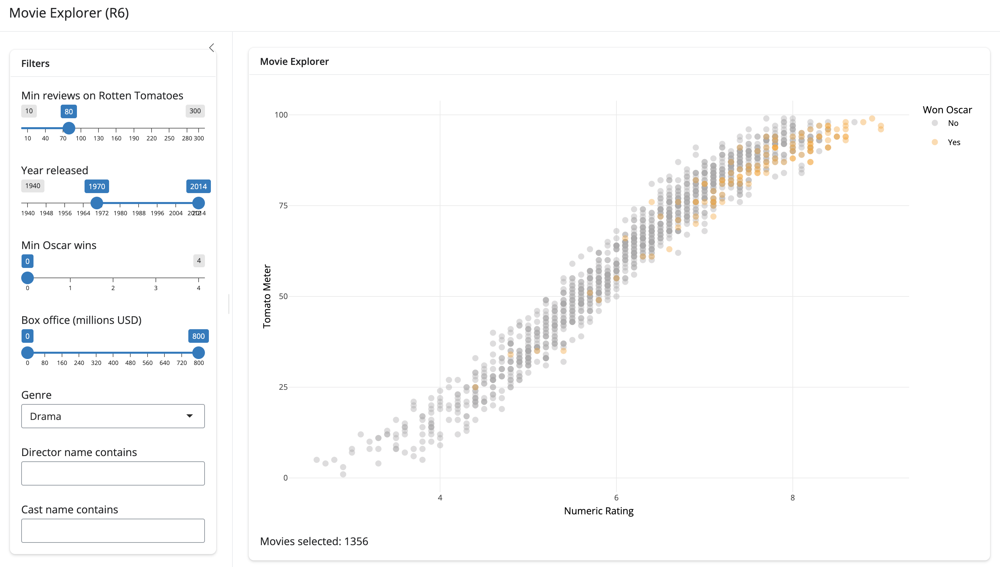

```{r}
#| label: setup
#| eval: true
#| echo: false
#| include: false
source("../_common.R")
options(scipen = 999)
library(quarto)
library(rmarkdown)
library(shiny)
library(R6)
library(ttdviewer)
```


As Shiny applications grow, organizing code into modular, object-oriented pieces becomes crucial. While Shiny's reactive programming model is naturally functional, **`R6`** classes provide a powerful abstraction for encapsulating state, behavior, and business logic. If you're building a Shiny app-package, **`R6`** brings real benefits—clean separation of concerns, easier testing, enforced namespace isolation, and testable business logic.

But **`R6`** in Shiny can take different forms. In this post, we'll compare two patterns:

1. **Full R6 modules** (`rsixer`): Wrap every module in an R6 class with `$ui()` and `$server()` methods
2. **Hybrid R6 + functions** (`movexplR6`): Keep modules function-based; use R6 for stateful business logic

We'll explore what each pattern buys you, when to use each, and how they compare in practice.

## What is **`R6`**?

**`R6`** is an object-oriented system in R that creates reference-based objects. Unlike `S3` or `S4`, **`R6`** objects are mutable and support encapsulation (i.e., public and private members). **`R6`** objects feel familiar for Python or Java developers because they both include similar implementations.

To create **`R6`** objects, install the **`R6`** package: 

```{r}
#| eval: false 
#| code-fold: false
install.packages("R6")
```

**`R6`** objects are used throughout the R ecosystem:

- **[`plumber2`](https://github.com/posit-dev/plumber2/blob/main/R/Plumber2.R)** uses **`R6`** to organize REST API routers and middleware; each route handler is a method bound to an **`R6`** object, making routing logic reusable and testable

- **[`shinytest2`](https://github.com/rstudio/shinytest2/blob/main/R/app-driver.R)** uses **`R6`** for app testing objects; the `AppDriver` class bundles together UI selectors, server interactions, and assertions, making test code fluent and maintainable

Even Shiny itself uses reactive objects (which are reference-based) to manage app state, so using **`R6`** objects in an app-package is a natural extension of that pattern.

In Shiny app-packages, **`R6`** objects are especially useful for:

1. Bundling UI generation with business logic (i.e., making the module a unified object)    
2. Managing state tied to a user session or module instance   
3. Encapsulating dependencies and configuration   

## Two Approaches to R6 in Shiny

To compare the two patterns, I've built two apps:

1. **`rsixer`**: A stock volatility dashboard where each module is an R6 class
2. **`movexplR6`**: A movie database explorer where modules stay function-based, but business logic lives in R6

Let's start with `rsixer` (full R6 modules) to see the architecture:

### R6 Modules 

Access the code here: [mjfrigaard.github.io/rsixer](https://mjfrigaard.github.io/rsixer/)

{width='100%' fig-align='center'}

#### App structure

```{verbatim}
R/
├── app_server.R #<1>
├── app_ui.R #<2>
├── launch.R #<3>
├── ModDownload.R #<4>
├── ModInputs.R #<5>
├── ModOutputs.R #<6>
├── mod_hoverinfo.R #<7>
└── mod_tooltip.R #<8>

```

1. Instantiates **`R6`** module classes (`ModInputs$new("inputs")`, `ModOutputs$new("outputs")`, `ModDownload$new("download")`) and calls their `$server()` methods sequentially; passes reactive values downstream     
2. Top-level UI function; calls `$ui()` method on each **`R6`** instance to compose the page      
3. App entry point; calls `shinyApp(ui, server)`      
4. **R6 class bundling download UI and server logic; single instantiation ensures UI and server share the same `id` internally (equivalent to `mod_download.R` in `tooltipexplorer`)**    
5. **R6 class bundling inputs UI and server logic; returns reactive list from `$server()` method (equivalent to `mod_inputs.R` in `tooltipexplorer`)**   
6. **R6 class bundling outputs UI and server logic; consumes reactive inputs from `ModInputs` (equivalent to `mod_outputs.R` in `tooltipexplorer`)**    
7. Helper that wraps hover/tooltip text for `reactable` table cells (identical to `tooltipexplorer`)    
8. Tooltip icon helper component used in module labels (identical to `tooltipexplorer`)     

Key difference from function-based modules: **each module is a class**. Instead of separate `mod_inputs_ui.R` and `mod_inputs_server.R` functions, there's a single `ModInputs.R` file containing one R6 class with `$ui()` and `$server()` methods. This ensures the namespace ID is bound once at instantiation and shared by both methods.

### R6 for Business Logic 

Access the code here: [mjfrigaard.github.io/movexplR6](https://mjfrigaard.github.io/movexplR6/)

{width='100%' fig-align='center'}

`movexplR6` takes a different approach: it keeps Shiny modules **function-based** but uses **`R6`** for business logic and data management. Rather than wrapping each module in a class, it reserves **`R6`** for stateful, reusable concerns (database connections, data loading, filtering logic).

#### App structure

```{verbatim}
R/
├── launch_app.R #<1>
├── movies_server.R #<2>
├── movies_ui.R #<3>
├── MovieData.R #<4>
├── mod_filters.R #<5>
├── mod_plot.R #<6>
└── utils.R #<7>

```
1. App entry point; launches the Shiny app
2. Main server function; instantiates `MovieData` and wires modules together
3. Top-level UI function; calls `mod_filters_ui()` and `mod_plot_ui()`
4. **R6 class managing SQLite database connection, data loading, and filtering logic**
5. Function-based filter inputs module; returns reactive list of filter/axis selections
6. Function-based plot display module; consumes reactive movies and filters
7. Utility functions (theme, constants, helpers)

**Key difference**: Modules stay function-based (`mod_filters.R`, `mod_plot.R` each contain UI and server functions), but the data layer is encapsulated in an R6 class (`MovieData`). This separates UI/reactivity concerns from resource management.

## Architectures

Both patterns work, but they solve different problems. `rsixer` enforces architecture at the module level; `movexplR6` enforces it at the business logic layer. The choice depends on where your app's complexity lives.

### R6 Modules 

In `rsixer`, each *module* is an R6 class. When writing **`R6`** modules, both the UI and server logic are wrapped into a single **class**. Below is a simplified example from `rsixer` (view the full version [on GitHub.](https://github.com/mjfrigaard/rsixer/blob/main/R/ModInputs.R)).

```{r}
#| eval: false 
#| code-fold: true 
#| code-summary: 'hide/show ModInputs'
ModInputs <- R6::R6Class(
  "ModInputs",
  public = list(
    initialize = function(id = "inputs") { #<1>
      private$id <- id
      private$ns <- shiny::NS(id)
    }, #<1>
    ui = function() { #<2>
      bslib::sidebar(
        width = 280,
        bg = "#f8f9fa",
        shiny::selectizeInput( #<3>
          inputId = private$ns("tickers"),
          label = shiny::tags$span(
            "Tickers",
            mod_tooltip(
              trigger = bsicons::bs_icon("info-circle"),
              type = "bslib",
              contents = "Enter one or more stock ticker symbols (e.g. AAPL, MSFT).",
              size = "0.85rem",
              style = "color:#6c757d"
            )
          ),
          choices = default_tickers,
          selected = c("AAPL", "MSFT", "GOOGL"),
          multiple = TRUE,
          options = list(
            plugins = list("remove_button"),
            placeholder = "Add a ticker\u2026",
            create = TRUE
          )
        ), #<3>
        shiny::dateRangeInput( #<4>
          inputId = private$ns("dates"),
          label = "Date range",
          start = Sys.Date() - 365,
          end = Sys.Date(),
          min = "2000-01-01",
          max = Sys.Date()
        ), #<4>
        shiny::sliderInput( #<5>
          inputId = private$ns("vol_window"),
          label = shiny::tags$span(
            "Rolling vol window (days)",
            mod_tooltip(
              trigger = bsicons::bs_icon("info-circle"),
              type = "bslib",
              contents = "Number of trading days used for the rolling volatility calculation.",
              size = "0.85rem",
              style = "color:#6c757d"
            )
          ),
          min = 5L,
          max = 120L,
          value = 30L,
          step = 5L
        ), #<5>
        shiny::actionButton( #<6>
          inputId = private$ns("fetch"),
          label = "Fetch data",
          icon = shiny::icon("download"),
          class = "btn-primary w-100"
        ), #<6>
        bslib::card( #<7>
          bslib::card_header(
            bsicons::bs_icon("file-earmark-arrow-down"), " Download Report"
          ),
          bslib::card_body(
            shiny::selectInput(
              inputId = private$ns("format"),
              label = "Report format",
              choices = c("HTML" = "html", "PDF" = "pdf"),
              selected = "html"
            ),
            shiny::downloadButton(
              outputId = private$ns("download"),
              label = "Download",
              icon = shiny::icon("download"),
              class = "btn-outline-primary w-100"
            )
          )
        ) #<7>
      )
    }, #<2>
    
    server = function() { #<8>
      shiny::moduleServer(private$id, function(input, output, session) {
        shiny::observe({ #<9>
          shiny::req(input$fetch)
          if (length(input$tickers) == 0) {
            shiny::showNotification(
              "Please select at least one ticker.",
              type = "warning"
            )
          }
        }) #<9>
        shiny::reactive({ #<10>
          with_logging(
            context = "ModInputs / reactive list",
            ns = "rsixer/inputs",
            {
              inp <- list(
                tickers = input$tickers,
                from = input$dates[1],
                to = input$dates[2],
                vol_window = input$vol_window,
                fetch = input$fetch,
                format = input$format
              )
              inp
            }
          )
        }) #<10>
      })
    }
  ), #<8>
  private = list( #<11>
    id = NULL,
    ns = NULL
  ) #<11>
)
```
1. `initialize()` stores the module's namespace ID and creates a namespace function
2. `ui()` is a public method that builds UI tags; it uses `private$ns()` to namespace inputs  
3. Stock ticker picker 
4. Date range input  
5. Rolling-vol window   
6. Fetch stock data 
7. Report download (placeholder) 
8. `server()` wraps the module server logic and returns a reactive expression
9. Fetch button observer   
10.  Reactive inputs list  
11. `private` members hold internal state; can't be accessed from outside the object


Let's compare `{R6}` to function-based modules. 

#### R6 Modules vs. standard functions

`rsixer` bundles both UI and server into a single **`R6`** class. `ModInputs$new("inputs")` creates one instance where the `id` is stored in `private$id` and automatically available to both the `ui()` and `server()` methods.

```{mermaid}
%%| eval: true
%%| fig-align: 'center'
%%| fig-caption: 'Module Architecture: R6'
%%| echo: false
%%{init: {'theme': 'base', 'themeVariables': { 'fontFamily': 'monospace', "darkMode":true}}}}%%


flowchart TD
    subgraph R6Based["<strong>R6 Class</strong>"]
        New["<strong>ModInputs$new('inputs')</strong>"]
        Instance["Single instance<br/>owns <code>id</code> & <code>ns</code>"]
        UiM["<strong>$ui()</strong>"]
        ServM["<strong>$server()</strong>"]
    end

    New -->|"binds <code>id</code>"| Instance
    Instance -->|"uses <code>id</code>"| UiM
    Instance -->|"uses <code>id</code>"| ServM

    style New fill:#4CBB9D,color:#FFFFFF,rx:5,ry:5,font-family:monospace
    style Instance fill:#E0F0ED,color:#000000,stroke:#4CBB9D
    style UiM fill:#4CBB9D,color:#FFFFFF,rx:5,ry:5,font-family:monospace
    style ServM fill:#4CBB9D,color:#FFFFFF,rx:5,ry:5,font-family:monospace

```

The `id` is **bound at instantiation and encapsulated** in the object. Both `$ui()` and `$server()` methods access it from the same source, so namespace mismatches are architecturally impossible.

In function-based modules, both UI and server functions must receive the same `id` argument to share a namespace.

```{mermaid}
%%| eval: true
%%| fig-align: 'center'
%%| fig-caption: 'Function-Based Pattern (No Encapsulation)'
%%| echo: false
%%{init: {'theme': 'base', 'themeVariables': { 'fontFamily': 'monospace', "darkMode":true}}}}%%

flowchart TD
    subgraph FuncBased["<strong>Function-Based</strong>"]
        direction LR
        UICall("mod_inputs_ui('inputs')")
        ServerCall("mod_inputs_server('inputs')")
        Separate(("<em>Two separate<br/>function calls<br/>same ID by convention</em>"))
    end

    style UICall fill:#FFF8E7,color:#000000,stroke:#999,font-family:monospace
    style ServerCall fill:#FFF8E7,color:#000000,stroke:#999,font-family:monospace
    style Separate fill:#FFE0E0,color:#000000,stroke:#c0392b

```

The responsibility for keeping them in sync falls on the developer.

### R6 for Business Logic

`movexplR6` shows a different pattern: the **`R6`** is used for resources and business logic while keeping Shiny modules function-based. This cleanly separates concerns: stateful data access in R6, stateless UI/reactivity in functions.

The `MovieData` class in `movexplR6` manages a SQLite connection and filtering logic:

```{r}
#| eval: false
#| code-fold: true
#| code-summary: 'hide/show MovieData class'
MovieData <- R6::R6Class(
  "MovieData",
  public = list(
    con = NULL,
    all_movies = NULL,
    initialize = function(db_path) { #<1>
      self$con <- DBI::dbConnect(RSQLite::SQLite(), db_path)
      self$all_movies <- private$load_data()
    }, #<1>
    filter = function(reviews = 10, oscars = 0, year = c(1940, 2014),
                      boxoffice = c(0, 800), genre = "All",
                      director = "", cast = "") { #<2>
      self$all_movies |>
        dplyr::filter(Reviews >= reviews, Oscars >= oscars)
    }, #<2>
    disconnect = function() { #<3>
      DBI::dbDisconnect(self$con)
    } #<3>
  ),
  private = list(
    load_data = function() { # joins and collects query results
    }
  )
)
```
1. Open connection and load data on initialization
2. Public `$filter()` method; no UI concern here, just business logic
3. Explicit `$disconnect()` method for cleanup

Meanwhile, the UI modules stay function-based and lightweight. In `movies_server()`, you instantiate the R6 object once and wire it into the reactive pipeline:

```{r}
#| eval: false
#| code-fold: false
movies_server <- function(input, output, session) {
  movie_data <- MovieData$new("movies.db")
  shiny::onStop(function() movie_data$disconnect())

  filters <- mod_filters_server("filters")
  movies <- shiny::reactive({
    movie_data$filter(
      reviews = filters()$reviews,
      oscars = filters()$oscars,
      # ... other filter params
    )
  })
  mod_plot_server("plot", movies, filters)
}
```

This hybrid approach works well when your app has complex data operations, external connections, or shared state that doesn't fit naturally into Shiny's reactive model. You keep the UI/server modules lightweight and function-based while R6 handles the heavy lifting.

## Comparison: rsixer vs movexplR6

Both apps need to manage state, but they organize it differently.

### Public and Private Members

In R6, `public` methods are callable from outside the object; `private` members are internal. With full R6 modules (`rsixer`):

- **Public methods** (`$ui()`, `$server()`) build the interface and run reactive logic
- **Private members** (`private$id`, `private$ns`) store namespace information that both methods share

This sharing is the key benefit: the `id` is set once at instantiation and automatically available to both methods.

**Initialization:**

```{r}
#| eval: false
#| code-fold: false 
initialize = function(id = "inputs") {
  private$id <- id
  private$ns <- NS(id)
}
```

**UI method:**

```{r}
#| eval: false
#| code-fold: false 
ui = function() {
  sidebar(
    selectizeInput(
      inputId = private$ns("tickers"),  # <-- uses private namespace
      label = "Tickers",
      # ...
    ),
    # ... more inputs
  )
}
```

**Server method:**

```{r}
#| eval: false
#| code-fold: false 
server = function() {
  moduleServer(private$id, function(input, output, session) {  # <-- same ID
    reactive({
      list(
        tickers = input$tickers,
        from = input$dates[1],
        to = input$dates[2],
        vol_window = input$vol_window
      )
    })
  })
}
```

The `id` and `ns` are shared across methods, so they're always in sync. This is enforced by the architecture itself.

### Lifecycle

The lifecycle flows like this:

1. `ModInputs$new(id = "inputs")` runs `initialize()`, binding the ID
2. `ModInputs$ui()` is called in `app_ui()`, using `private$ns()` for namespacing
3. `ModInputs$server()` is called in `app_server()`, using `private$id` for module scope

Both methods share the same private state.

```{mermaid}
%%| eval: true
%%| fig-align: 'center'
%%| fig-caption: 'R6 Module Lifecycle (rsixer)'
%%| echo: false
%%{init: {'theme': 'base', 'themeVariables': { 'fontFamily': 'monospace', "darkMode":true}}}}%%

flowchart LR
    subgraph "<strong>R6 Module Lifecycle</strong>"
        Init["<strong>ModInputs$new(id)</strong><br><em>Runs initialize()</em>"]
        Id("<strong>private$id</strong>")
        Ns("<strong>private$ns()</strong>")
        UI["<strong>$ui()</strong><br/><em>Called in<br>app_ui()</em>"]
        Server["<strong>$server()</strong><br><em>Called in app_server()</em>"]
    end

    Init -->|"stores"| Id
    Init -->|"creates"| Ns
    UI -->|"uses"| Ns
    Server -->|"uses"| Id

    style Init fill:#4CBB9D,color:#FFFFFF,rx:5,ry:5,font-family:monospace
    style Id fill:#FFFFFF,color:#000000,stroke:#333,font-family:monospace
    style Ns fill:#FFFFFF,color:#000000,stroke:#333,font-family:monospace
    style UI fill:#4CBB9D,color:#FFFFFF,rx:5,ry:5,font-family:monospace
    style Server fill:#4CBB9D,color:#FFFFFF,rx:5,ry:5,font-family:monospace

```

### Private Members

The `private` list holds internal state (`id` and `ns`). These are accessed by public methods but cannot be modified from outside the object.

```{mermaid}
%%| eval: true 
%%| echo: false 
%%| fig-align: 'center' 
%%| fig-caption: 'Namespace Isolation'
%%{init: {'theme': 'base', 'themeVariables': { 'fontFamily': 'monospace', "darkMode":true}}}}%%

flowchart TD
    subgraph "<strong>Namespace Isolation</strong>"
        Ns(["<strong>ns()</strong>"])
        IDs("input/output IDs")
        Prefix("Prefixed IDs<br><code>ns-input</code>")
    end

    Ns -->|prefixes| IDs
    IDs -->|creates| Prefix
    Prefix -->|prevents| Conflicts(["<em>ID conflicts<br>across modules</em>"])

    style Ns fill:#4CBB9D,color:#FFFFFF,rx:5,ry:5,font-family:monospace,text-align:'center'
    style IDs fill:#FFFFFF,color:#000000,stroke:#333
    style Prefix fill:#FFFFFF,color:#000000,stroke:#333
    style Conflicts fill:#FFE0E0,color:#000000,stroke:#c0392b
    
```

## State Management: Two Approaches

State ownership differs between the two patterns.

### Full R6 Modules (`rsixer`)

In `rsixer`, each module is an instance with its own private state. When `ModOutputs` needs data from `ModInputs`, it receives the reactive list returned by `ModInputs$server()` and consumes it as a parameter. 

```{mermaid}
%%| eval: true
%%| fig-align: 'center'
%%| fig-caption: 'State Flow: R6 Modules (rsixer)'
%%| echo: false
%%{init: {'theme': 'base', 'themeVariables': { 'fontFamily': 'monospace', "darkMode":true}}}}%%

flowchart TD
    subgraph R6Flow["<strong>R6 Module Flow</strong>"]
        MI["<strong>ModInputs$new()</strong>"]
        MS["<strong>ModInputs$server()</strong>"]
        MReact[/"reactive list"/]
        MPass["<strong>ModOutputs$server()</strong>"]
        MOwn(["<em>State: owned by<br/>module instance</em>"])
    end

    MI -->|"creates instance"| MS
    MS -->|"returns"| MReact
    MReact -->|"consumed by"| MPass
    MPass --> MOwn

    style MI fill:#4CBB9D,color:#FFFFFF,rx:5,ry:5,font-family:monospace
    style MS fill:#4CBB9D,color:#FFFFFF,rx:5,ry:5,font-family:monospace
    style MPass fill:#4CBB9D,color:#FFFFFF,rx:5,ry:5,font-family:monospace
    style MOwn fill:#E0F0ED,color:#000000,stroke:#4CBB9D
    
```

Dependencies flow in one direction: downstream modules receive what they need from upstream instances, and can't modify the upstream module's private state. The architecture itself prevents certain bugs.

### R6 for Business Logic (`movexplR6`)

In `movexplR6`, the R6 layer manages resources and data, while function-based modules handle the UI/reactivity. We covered the architecture earlier; now let's see what happens when we inspect the state at runtime and compare it across both patterns.

## Debugging and Inspection

Understanding module state is critical when building. Let's see how each pattern surfaces this.

### R6 Objects (`rsixer`)

The full R6 approach lets us inspect the module object directly at runtime:

```{r}
#| eval: false
#| code-fold: false

# in R/app_server.R
inputs <- ModInputs$new(id = "inputs")
inputs_r <- inputs$server()

# Inspect the object
str(inputs)  # Shows the R6 class structure
```

Output:

```{verbatim}
Classes 'ModInputs', 'R6' <ModInputs>
  Public:
    clone: function (deep = FALSE)
    initialize: function (id = "inputs")
    server: function ()
    ui: function ()
  Private:
    id: inputs
    ns: function (id)
```

This tells us immediately that the module owns an `id` (bound at instantiation), a namespace function, and public methods for UI and server. Everything is encapsulated in one object.

### Function-Based Modules (`movexplR6`)

In `movexplR6`, modules stay function-based, so there's no object to inspect. But the R6 data layer (`MovieData`) is directly inspectable:

```{r}
#| eval: false
#| code-fold: false

# in R/movies_server.R
movie_data <- MovieData$new("movies.db")

# Inspect the object
str(movie_data)  # Shows the R6 class structure
```

Output:

```{verbatim}
Classes 'MovieData', 'R6' <MovieData>
  Public:
    all_movies: data.frame (1000 obs, 15 vars)
    clone: function (deep = FALSE)
    con: SQLiteConnection
    disconnect: function ()
    filter: function (reviews = 10, oscars = 0, ...)
    initialize: function (db_path)
  Private:
    load_data: function ()
```

This tells us the data layer's state (connection, all_movies data frame), methods, and lifecycle. The modules themselves remain lightweight.

## Why Encapsulation Matters

The **R6** approach (whether full modules or business logic layer) makes state ownership explicit. With full R6 modules (`rsixer`):

- The module's identity and dependencies are clear: `inputs$server()` uses the same ID as `inputs$ui()`
- Namespace mismatches are impossible; the ID is bound at instantiation

With the hybrid approach (`movexplR6`):

- Business logic is centralized in one object that manages resources
- Modules remain simple and stateless
- The connection lifecycle and data access are clear and testable

Without encapsulation (pure function-based), a typo like passing `"input"` instead of `"inputs"` to `mod_inputs_server()` creates a silent namespace mismatch—the app runs but breaks silently.

## Business Logic vs UI Encapsulation

The key difference between the two patterns:

- **rsixer (full R6 modules)**: Encapsulates UI/server logic. Each module is a self-contained unit.
- **movexplR6 (hybrid)**: Encapsulates business logic. Modules stay simple; complexity lives in the data layer.

In `movexplR6`, the data layer owns the connection lifecycle:

```{r}
#| eval: false
#| code-fold: false
movies_server <- function(input, output, session) {
  # Initialize R6 data layer
  movie_data <- MovieData$new("movies.db")  #<1>
  shiny::onStop(function() movie_data$disconnect())  #<2>

  # Use function-based modules
  filters <- mod_filters_server("filters")
  
  # Wire R6 to reactive pipeline
  movies <- shiny::reactive({
    movie_data$filter(  #<3>
      reviews = filters()$reviews,
      oscars = filters()$oscars
    )
  })
  
  mod_plot_server("plot", movies, filters)
}
```
1. Initialize the data layer once per session
2. Register cleanup on session end
3. Call R6 methods from reactive expressions

The R6 object ensures the database connection opens on initialization and closes when the session ends. Function-based modules stay lightweight—they don't need to know about connection management. They just consume filtered data from the reactive expression.

```{mermaid}
%%| eval: true
%%| fig-align: 'center'
%%| fig-caption: 'Hybrid: R6 Data Layer + Function Modules'
%%| echo: false
%%{init: {'theme': 'base', 'themeVariables': { 'fontFamily': 'monospace', "darkMode":true}}}}%%

flowchart TD
    subgraph R6Layer["<strong>R6 Data Layer</strong>"]
        New["<strong>MovieData$new()</strong>"]
        Filter["<strong>$filter()</strong>"]
        Con[("Database")]
    end

    subgraph FuncLayer["<strong>Function Modules</strong>"]
        ModFilters["<strong>mod_filters_server()</strong>"]
        ModPlot["<strong>mod_plot_server()</strong>"]
    end

    New -->|"opens"| Con
    ModFilters -->|"returns params"| Filter
    Filter -->|"queries"| Con
    Filter -->|"returns"| ModPlot

    style New fill:#4CBB9D,color:#FFFFFF,rx:5,ry:5,font-family:monospace
    style Filter fill:#4CBB9D,color:#FFFFFF,rx:5,ry:5,font-family:monospace
    style Con fill:#B3CDE0,color:#000000,stroke:#333,font-family:monospace
    style ModFilters fill:#FFF8E7,color:#000000,stroke:#999,font-family:monospace
    style ModPlot fill:#FFF8E7,color:#000000,stroke:#999,font-family:monospace
```

## Trade-offs: rsixer vs movexplR6

Both patterns solve encapsulation problems, but they apply R6 at different layers.

| Aspect | **rsixer (Full R6)** | **movexplR6 (Hybrid)** |
|--------|----------------------|----------------------|
| **Module structure** | Each module is an R6 class (`ModInputs`, `ModOutputs`, etc.) | Modules stay function-based (`mod_filters`, `mod_plot`) |
| **Where state lives** | Private members in each R6 instance (`private$id`, `private$ns`) | R6 class manages data/resources (`MovieData$all_movies`, `MovieData$con`) |
| **Complexity per module** | Higher (must define `initialize()`, `ui()`, `server()`) | Lower (just `mod_*_ui()` and `mod_*_server()` functions) |
| **Namespace safety** | Guaranteed; ID is bound at instantiation | Developer's responsibility; functions must receive same ID |
| **Resource lifecycle** | Each module owns its own data | Central R6 object owns resources; modules consume them |
| **When to use** | Apps with complex module interdependencies; multi-developer projects | Apps with clear UI/data separation; heavy resource management needs |
| **Testing** | Modules are self-contained objects; easier to unit test | R6 layer is testable; modules tested via integration tests |
| **Code reuse** | Modules can be exported and reused as package API | Business logic (R6) is reusable; UI modules are app-specific |

Both patterns are valid. The choice depends on where your complexity lives:

- **Choose rsixer pattern** if:
  - You have many interdependent modules
  - You want to reuse modules across apps (export them as a package)
  - Your team is large or you want to enforce architectural constraints
  - Namespace safety is critical

- **Choose movexplR6 pattern** if:
  - Your app has a clear data layer (database, API, cache)
  - Modules are mostly independent and simple
  - You want lightweight, straightforward code for UI/reactivity
  - Business logic is complex but UI is simple

## Using R6 Modules (rsixer)

In the app's UI, instantiate R6 objects and call their `$ui()` methods:

```{r}
#| eval: false 
#| code-fold: false 
app_ui <- function() {
  page_fillable(
    inputs$ui(),
    outputs$ui(),
    download$ui()
  )
}
```

In the app's server, instantiate R6 objects and wire their `$server()` methods together:

```{r}
#| eval: false 
#| code-fold: false 
app_server <- function(input, output, session) {
  
  inputs <- ModInputs$new(id = "inputs") #<1>
  inputs_r <- inputs$server()

  outputs <- ModOutputs$new(id = "outputs") #<2>
  perf_r <- outputs$server(inputs_r = inputs_r)

  download <- ModDownload$new(id = "download") #<3>
  download$server(inputs_r = inputs_r, perf_r = perf_r)
}
```
1. Instantiate input module; its `$server()` returns a reactive list
2. Instantiate output module; consume `inputs_r` from step 1
3. Instantiate download module; consume both `inputs_r` and `perf_r`

Each module is instantiated fresh per session. There's no global state, and reactive dependencies flow naturally between instances.

## Using Hybrid R6 (movexplR6)

In a hybrid app, the server function instantiates the R6 data layer once and wires function-based modules to it:

```{r}
#| eval: false
#| code-fold: false
movies_server <- function(input, output, session) {
  # R6 data layer (instantiated once per session)
  movie_data <- MovieData$new("movies.db")
  shiny::onStop(function() movie_data$disconnect())

  # Function-based modules (stateless, simple)
  filters <- mod_filters_server("filters")
  
  # Reactive wrapper around R6 business logic
  movies <- shiny::reactive({
    movie_data$filter(
      reviews = filters()$reviews,
      oscars = filters()$oscars,
      year = filters()$year,
      boxoffice = filters()$boxoffice,
      genre = filters()$genre,
      director = filters()$director,
      cast = filters()$cast
    )
  })

  # Pass results to next module
  mod_plot_server("plot", movies, filters)
}
```

The R6 object owns the resource lifecycle; modules are simple and stateless.

## Reactivity

**`R6`** objects themselves are not reactive—they're just containers for logic and state. To make an R6 module respond to user input, the `server()` method must return reactive expressions.

In `rsixer`'s `ModInputs`, the `server()` method returns a reactive list:

```{r}
#| eval: false 
#| code-fold: false
server = function() {
  moduleServer(private$id, function(input, output, session) {
    reactive({
      list(
        tickers = input$tickers,
        from = input$dates[1],
        to = input$dates[2],
        vol_window = input$vol_window
      )
    })
  })
}
```

This reactive list is consumed by downstream modules:

```{r}
#| eval: false 
#| code-fold: false
# In ModOutputs$server()
server = function(inputs_r) {
  moduleServer(private$id, function(input, output, session) {
    prices_r <- eventReactive(inputs_r()$fetch, {
      inp <- inputs_r()
      get_stock_prices(
        tickers = inp$tickers,
        from = inp$from,
        to = inp$to
      )
    })
  })
}
```

The dependency graph is explicit: downstream modules depend on upstream reactives.

In `movexplR6`, the pattern is similar—the R6 data layer is called from reactive expressions:

```{r}
#| eval: false
#| code-fold: false
movies <- shiny::reactive({
  movie_data$filter(
    reviews = filters()$reviews,
    oscars = filters()$oscars,
    year = filters()$year
  )
})
```

When filter inputs change, `movies()` re-evaluates and calls `movie_data$filter()` with new parameters.

## Documenting R6 Classes

As your app-package scales, teammates and users need to understand module and class interfaces. Documenting **`R6`** classes with **[`roxygen2`](https://roxygen2.r-lib.org/)** makes `?ModInputs` or `?MovieData` complete references. Modern `roxygen2` (7.0.0+) handles **`R6`** seamlessly.

### Class-level documentation

Start with roxygen comments above the `R6Class()` call:

```{r}
#| eval: false
#| code-fold: show
#| code-summary: 'hide/show ModInputs roxygen block'

#' ModInputs: Shiny Input Module #<1>
#'
#' @description #<2>
#' Encapsulates input controls for stock ticker selection, date range, and 
#' analysis parameters.
#'
#' @details #<2>
#' Bundles the UI and server logic for a reusable inputs module. Methods 
#' handle namespace management automatically to prevent ID conflicts across
#' module instances. The private fields `id` and `ns` are managed internally;
#' callers interact only via public methods.
#'
#' @examples #<2>
#' if (interactive()) {
#'   inputs <- ModInputs$new(id = "inputs")
#'   # Note: server() only runs inside moduleServer() or shinyApp()
#' }
#'
#' @export #<2>
ModInputs <- R6::R6Class(
  "ModInputs",
  # ...
)
```
1. Title and class name
2. `roxygen` tags; every line must follow a tag (no plain text intro allowed)

### Method documentation

Document each public method inline, right before the method definition. Methods get their own subsection in the generated help page.

```{r}
#| eval: false
#| code-fold: show
#| code-summary: 'hide/show ModInputs methods'

public = list(

  #' @description #<1>
  #' Initialize the module with a namespace ID.
  #' @param id Character scalar; the module's namespace identifier.
  #' @return A new `ModInputs` object.
  initialize = function(id = "inputs") {
    private$id <- id
    private$ns <- NS(id)
  },

  #' @description #<1>
  #' Build the module's UI.
  #' @return HTML tags with namespaced input elements.
  ui = function() {
    sidebar(
      selectizeInput(
        inputId = private$ns("tickers"),
        label = "Tickers",
        choices = default_tickers(),
        multiple = TRUE
      ),
      # ...
    )
  },

  #' @description #<1>
  #' Start the server-side reactive logic.
  #' @return A reactive list containing user selections.
  server = function() {
    moduleServer(private$id, function(input, output, session) {
      reactive(list(
        tickers = input$tickers,
        dates = input$dates,
        vol_window = input$vol_window
      ))
    })
  }
)
```
1. Each method starts with `@description`; remaining tags follow

### **`R6`** help pages

When we run `devtools::document()`, `roxygen2` parses the `#'` blocks and generates the `.Rd` files with separate subsections for the class description, each public method, and examples. The help page becomes the module's contract.

```{mermaid}
%%| eval: true
%%| echo: false
%%| fig-align: 'center'
%%| fig-caption: 'roxygen2 Workflow for R6 Classes'
%%{init: {'theme': 'base', 'themeVariables': { 'fontFamily': 'monospace', "darkMode":true}}}}%%

flowchart TD
    subgraph Source["<strong>R/ModInputs.R</strong>"]
        ClassBlock["Class block<br/><code>@description @details @export</code>"]
        MethodBlock["Inline method blocks<br/><code>@description @param @return</code>"]
    end
    Document(["<strong>devtools::document()</strong>"])
    Rd["<strong>man/ModInputs.Rd</strong><br/><em>Methods section,<br/>one subsection per method</em>"]
    Namespace["<strong>NAMESPACE</strong><br/><code>export(ModInputs)</code>"]
    Help(["<strong>?ModInputs</strong><br/><em>and pkgdown site</em>"])

    ClassBlock --> Document
    MethodBlock --> Document
    Document --> Rd
    Document --> Namespace
    Rd --> Help
    Namespace --> Help

    style ClassBlock fill:#FFF8E7,color:#000000,stroke:#999,font-family:monospace
    style MethodBlock fill:#FFF8E7,color:#000000,stroke:#999,font-family:monospace
    style Document fill:#4CBB9D,color:#FFFFFF,rx:5,ry:5,font-family:monospace
    style Rd fill:#FFFFFF,color:#000000,stroke:#333,font-family:monospace
    style Namespace fill:#FFFFFF,color:#000000,stroke:#333,font-family:monospace
    style Help fill:#4CBB9D,color:#FFFFFF,rx:5,ry:5,font-family:monospace
```

### Documenting Business Logic Classes

When R6 is used for data/business logic (like `MovieData` in `movexplR6`), focus documentation on public methods and lifecycle:

```{r}
#| eval: false
#| code-fold: show
#| code-summary: 'hide/show MovieData roxygen block'

#' Movie Database Manager #<1>
#'
#' @description #<2>
#' Manages a SQLite database connection, loads a joined dataset from the
#' `omdb` and `tomatoes` tables, and applies filter logic derived from
#' Shiny input values.
#'
#' @details #<2>
#' On initialization the class opens a connection to the SQLite database at
#' `db_path`, joins the two tables via `inner_join()`, collects the result
#' into memory, and stores it in `$all_movies`. Call `$filter()` to obtain a
#' filtered data frame for rendering. Call `$disconnect()` to close the
#' connection explicitly; the private `finalize()` method also calls it when
#' the object is garbage collected.
#'
#' @export #<2>
MovieData <- R6::R6Class(
  "MovieData",
  public = list(
    con = NULL,
    all_movies = NULL,

    #' @description Connect to the SQLite database and load all movie data.
    #' @param db_path Path to the SQLite database file.
    #' @return The initialized `MovieData` object invisibly.
    initialize = function(db_path) { # ... },

    #' @description Filter the in-memory data frame using input values.
    #' @param reviews Minimum number of reviews.
    #' @param oscars Minimum number of Oscar wins.
    #' @param year Integer vector of length 2: `c(min_year, max_year)`.
    #' @param boxoffice Numeric vector of length 2: box-office range in millions.
    #' @param genre Genre string; `"All"` disables the filter.
    #' @param director Partial director name; empty string disables the filter.
    #' @param cast Partial cast name; empty string disables the filter.
    #' @return A filtered data frame.
    filter = function(reviews = 10, oscars = 0, year = c(1940, 2014),
                      boxoffice = c(0, 800), genre = "All",
                      director = "", cast = "") { # ... },

    #' @description Explicitly close the database connection.
    #' @return Returns `NULL` invisibly; called for side effects.
    disconnect = function() { # ... }
  )
)
```
1. Class title
2. roxygen tags for class and methods

The key difference: business logic classes focus on method parameters, return types, and lifecycle (initialization, connection management, cleanup) rather than UI/namespace concerns.

### Packaging best practices

File organization depends on which pattern you're using.

For full **`R6`** module patterns (like `rsixer`), use `CamelCase` names for classes and place each in its own file:

```{verbatim}
R/ModInputs.R    # ModInputs class (one per file)
R/ModOutputs.R   # ModOutputs class
R/ModDownload.R  # ModDownload class
R/app_server.R   # Wires modules together; instantiates objects
R/app_ui.R       # Calls $ui() methods on each instance
```

For hybrid patterns (like `movexplR6`), separate business logic classes from modules:

```{verbatim}
R/MovieData.R      # Business logic R6 class
R/mod_filters.R    # Function-based UI/server modules
R/mod_plot.R       # Function-based UI/server modules
R/movies_server.R  # Wires modules and R6 objects together
R/movies_ui.R      # Composes UI from modules
```

In both cases, export **`R6`** classes with `@export` so package users can instantiate them. Never instantiate objects at package load time; always do it inside `app_server()` or module server functions to ensure one instance per session.

Apply the principle of one class per file for clarity, regardless of whether the class wraps a module or implements business logic.

### Tests 

Writing tests with `testthat` is especially valuable for **`R6`** modules. It's a good idea to test that instantiation works, the methods return expected types, and that passing different `id` values produces properly isolated namespaces:

```{r}
#| eval: false
#| code-fold: false
test_that("ModInputs instantiates with correct namespace", {
  mod <- ModInputs$new(id = "test_inputs")
  expect_equal(mod$.__enclos_env__$private$id, "test_inputs")
  expect_is(mod$ui(), "shiny.tag")
})
```

With `roxygen2` and **`R6`** together, teammates can run `?ModInputs` and immediately understand what the class does, the methods that are available, what parameters they accept, and what they return. That's the power of documentation over diving into the source `.R` file.

## Summary

I've compared two approaches to using R6 in Shiny app-packages:

**`rsixer` (Full R6 Modules)**
- Each module is an R6 class with `$ui()` and `$server()` methods
- State (namespace ID) is private and shared across methods
- Namespace mismatches are impossible; UI and server always sync
- Good for apps with complex module interdependencies
- Modules are reusable units; can be exported as a package API

**`movexplR6` (Hybrid R6 + Functions)**
- Modules stay function-based and lightweight
- R6 encapsulates business logic and resource management (database, API, caching)
- Developer must remember to pass the same `id` to UI and server functions
- Good for apps with clear separation between UI and data layers
- R6 layer is testable and reusable; modules are app-specific

Both patterns solve real problems:
- R6 modules enforce architecture and prevent namespace bugs
- R6 business logic layers centralize resource management and complex state

Neither is universally better. Choose based on where your complexity lives and how you want to organize your codebase.

**For working examples**, explore:
- **rsixer**: [mjfrigaard.github.io/rsixer](https://mjfrigaard.github.io/rsixer/)
- **movexplR6**: [mjfrigaard.github.io/movexplR6](https://mjfrigaard.github.io/movexplR6/)
