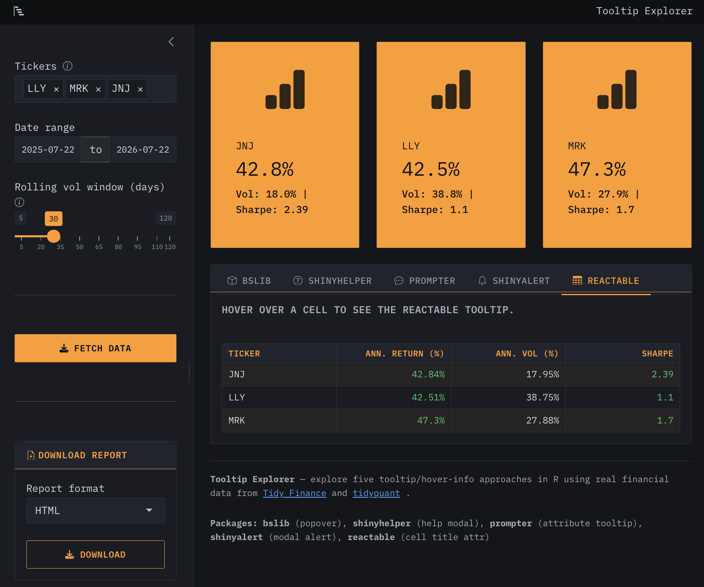
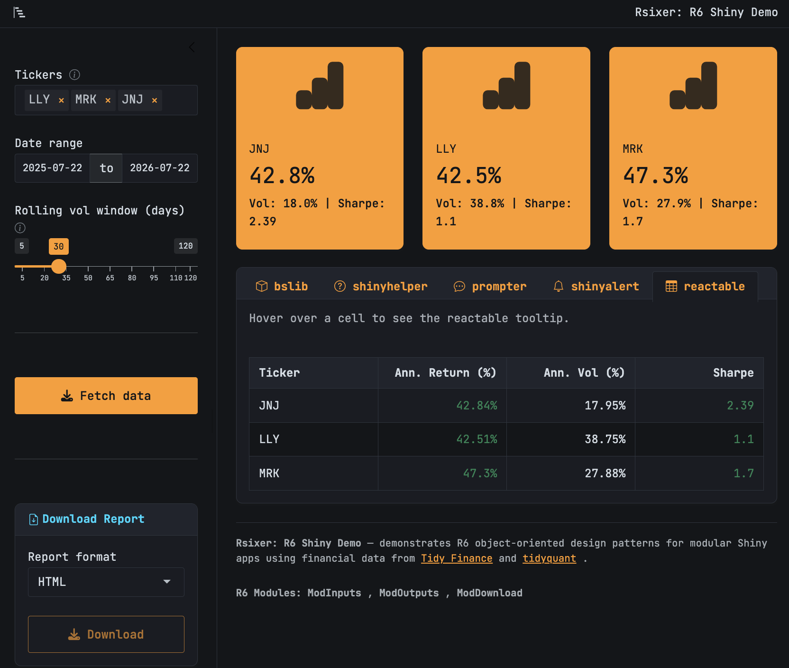

```{r}
#| label: setup
#| eval: true
#| echo: false
#| include: false
source("../_common.R")
options(scipen = 999)
library(quarto)
library(rmarkdown)
library(shiny)
library(R6)
library(ttdviewer)
```


As your Shiny application grows, organizing code into modular, object-oriented pieces becomes crucial. While Shiny's reactive programming model is naturally functional, `R6` classes provide a powerful abstraction for encapsulating state, behavior, and business logic. If you're building a Shiny app-package, R6 brings real benefits: clean separation of concerns, easier testing, and reusable module patterns that survive across projects.

In this post, we'll explore:

1. What `R6` is and why it shines in Shiny app-packages
2. Defining `R6` classes for Shiny modules (UI and server)
3. Wiring `R6` objects into your app's reactive flow


I've created two stock volatility apps to flesh out some of the differences between standard Shiny app-packges and R6 Shiny app-packages: 

## Standard shiny app-package

Access the code here: [mjfrigaard.github.io/tooltipexplorer](https://mjfrigaard.github.io/tooltipexplorer/)

{width='100%' fig-align='center'}

I've included the `R/` folder tree below to help understand how this application is built. Below are the application function (modules, master UI/server functions, theme helpers, and logging utilities).

```{verbatim}
R/
├── app_server.R #<1>
├── app_set_log_threshold.R #<2>
├── app_ui.R #<3>
├── custom_head.R #<4>
├── launch.R #<5>
├── mod_download.R #<6>
├── mod_hoverinfo.R #<7>
├── mod_inputs.R #<8>
├── mod_outputs.R #<9>
├── mod_tooltip.R #<10>
├── setup_theme.R #<11>
├── utils_reactable_theme.R #<12>
└── with_logging.R #<13>

1 directory, 13 files
```

1. Wires together function-based modules by calling `mod_inputs_server("inputs")`, `mod_outputs_server("outputs", ...)`, `mod_download_server("download", ...)` sequentially; passes reactive values between them    
2. Logging configuration setup (initializes `logger` threshold)   
3. Top-level UI function; calls `mod_inputs_ui()`, `mod_outputs_ui()`, `mod_download_ui()` to compose the page    
4. Helper function for displaying data in a compact format    
5. App entry point; calls `shinyApp(ui, server)`
6. Function-based download module; pairs `mod_download_ui()` and `mod_download_server(id)` in one file    
7. Helper that wraps hover/tooltip text for `reactable` table cells   
8. Function-based inputs module; contains `mod_inputs_ui(id)` and `mod_inputs_server(id)` returning reactive list   
9. Function-based outputs module; consumes `inputs_r` and renders performance metrics
10. Tooltip icon helper component   
11. Theme and styling configuration
12. `reactable` table theme utilities   
13. Logging wrapper utility for side-effect tracking

The functions below deal specifically with the gathering and computations of the stock data displayed in the application.   

```{verbatim}
R/
├── compute_rolling_vol.R #<1>
├── default_tickers.R #<2>
├── get_ff3_factors.R #<3>
├── get_stock_prices.R #<4>
├── get_stock_returns.R #<5>
├── summarise_performance.R #<6>
└── utils_operators.R #<7>

1 directory, 7 files
```

1. Computes rolling volatility metric for stock analysis  
2. Exports default ticker symbols as a package constant   
3. Fetches Fama-French 3-factor data from external source   
4. Fetches historical stock price data from API   
5. Calculates stock returns from price data
6. Calculates performance summary metrics (returns, Sharpe ratio, etc.)   
7. Custom operators (`%>%`, `%||%`, etc.)   

## `R6` app-package

Access the code here: [mjfrigaard.github.io/Rsixer](https://mjfrigaard.github.io/Rsixer/)

{width='100%' fig-align='center'}

If you're wondering why the applications look so similar, it's because the `Rsixer` application is a direct conversion of the `tooltipexplorer` into the `R6` architecture. The `R/` folder is below:

```{verbatim}
R/
├── app_server.R #<1>
├── app_ui.R #<2>
├── launch.R #<3>
├── mod_hoverinfo.R #<4>
├── mod_tooltip.R #<5>
├── ModDownload.R #<6>
├── ModInputs.R #<7>
├── ModOutputs.R #<8>
├── utils_data.R #<9>
├── utils_logging.R #<10>
├── utils_operators.R #<11>
├── utils_reactable_theme.R #<12>
└── utils_theme.R #<13>

1 directory, 13 files
```

1. Instantiates R6 module classes (`ModInputs$new("inputs")`, `ModOutputs$new("outputs")`, `ModDownload$new("download")`) and calls their `$server()` methods sequentially; passes reactive values downstream; the `id` is bound to the instance, preventing namespace mismatches.
2. Top-level UI function; calls `$ui()` method on each R6 instance to compose the page.
3. App entry point; calls `shinyApp(ui, server)`.
4. Helper that wraps hover/tooltip text for `reactable` table cells (identical to `tooltipexplorer`).
5. Tooltip icon helper component (identical to `tooltipexplorer`).
6. **R6 class bundling download UI and server logic; single instantiation ensures UI and server share the same `id` internally.**
7. **R6 class bundling inputs UI and server logic; returns reactive list from `$server()` method.**
8. **R6 class bundling outputs UI and server logic; consumes reactive inputs from `ModInputs`.**
9. Consolidated data-retrieval functions (`get_stock_prices()`, `get_stock_returns()`, `get_ff3_factors()`) in one file; reduces scattered file count vs. `tooltipexplorer`.  
10. Consolidated logging setup and utilities (e.g., `app_set_log_threshold()`, `logging` wrappers); contrasts with `tooltipexplorer`'s scattered approach.
11. Custom operators (`%>%`, `%||%`, etc.) (identical to `tooltipexplorer`).
12. reactable table theme utilities (identical to `tooltipexplorer`).
13. Simplified theme and styling configuration.


Notice there are 13 source files in `Rsixer` (vs. the 20 in `tooltipexplorer`). `R6` bundling eliminates the need for separate UI/server function pairs. We'll explore these benefits and more in the sections below. 

## What is R6?

`R6` is an object-oriented system in R that creates reference-based objects. Unlike `S3` or `S4`, `R6` objects are mutable and support encapsulation (i.e., public and private members). `R6` objects feel familiar for Python or Java developers because they both include similar implementations.

To create R6 objects, install the `R6` package: 

```{r}
#| eval: false 
#| code-fold: false
install.packages("R6")
```

`R6` is especially useful for:

1. Bundling UI generation with business logic (module as a unified object)  
2. Managing state tied to a user session or module instance
3. Encapsulating dependencies and configuration

In app-packages, `R6` objects can prevent us from scattering related logic across separate files. They also help avoid the need for global state or overly nested reactive functions.

## R6 vs Traditional Shiny Modules

Both function-based and R6 module patterns work; the difference lies in how they organize code and protect against state leaks as your app grows.

In `tooltipexplorer`, each module splits into two functions living in the same file. `mod_inputs.R` contains both `mod_inputs_ui(id)` and `mod_inputs_server(id)`. The UI function returns HTML tags, the server function returns a reactive list. 

```{mermaid}
%%| eval: true
%%| fig-align: 'center'
%%| fig-caption: 'Module Architecture: Function-Based'
%%| echo: false
%%{init: {'theme': 'base', 'themeVariables': { 'fontFamily': 'monospace', "darkMode":true}}}}%%

flowchart TD
    subgraph FuncBased["Function-Based (<code>tooltipexplorer</code>)"]
        direction LR
        UICall("mod_inputs_ui('inputs')")
        ServerCall("mod_inputs_server('inputs')")
        Separate(("<em>Two separate<br/>function calls</em>"))
    end
    
    UICall -.->|"wrong <code>id</code> passed"| ServerCall
    
    style UICall fill:#FFF8E7,color:#000000,stroke:#999,font-family:monospace
    style ServerCall fill:#FFF8E7,color:#000000,stroke:#999,font-family:monospace
    style Separate fill:#FFE0E0,color:#000000,stroke:#c0392b
    
```

Back in `app_server.R`, both get called with the same `id` argument—but they're completely independent; nothing ties them together except the developer's memory. If someone later calls `mod_inputs_ui("inputs")` in the UI but `mod_inputs_server("other_inputs")` in the server, Shiny won't complain. The UI and server end up in different namespaces, the module stops working, and no error gets raised. The bug is silent.

`Rsixer` eliminates this category of error by bundling both UI and server into a single R6 class. `ModInputs$new("inputs")` creates one instance where the `id` is stored in `private$id` and used by both the `ui()` and `server()` methods. 

```{mermaid}
%%| eval: true
%%| fig-align: 'center'
%%| fig-caption: 'Module Architecture: R6'
%%| echo: false
%%{init: {'theme': 'base', 'themeVariables': { 'fontFamily': 'monospace', "darkMode":true}}}}%%


flowchart TD
    subgraph R6Based["R6 Class (Rsixer)"]
        direction LR
        New["ModInputs$new('inputs')"]
        Instance["Single instance<br/>owns <code>id</code> & <code>ns</code>"]
        UiM["$ui()"]
        ServM["$server()"]
    end

    New -->|"binds <code>id</code>"| Instance
    Instance -->|"uses <code>id</code>"| UiM
    Instance -->|"uses <code>id</code>"| ServM

    style New fill:#4CBB9D,color:#FFFFFF,rx:5,ry:5,font-family:monospace
    style Instance fill:#E0F0ED,color:#000000,stroke:#4CBB9D
    style UiM fill:#4CBB9D,color:#FFFFFF,rx:5,ry:5,font-family:monospace
    style ServM fill:#4CBB9D,color:#FFFFFF,rx:5,ry:5,font-family:monospace
    
```

They share the same namespace function (`private$ns`) internally, so a mismatch is impossible. The instance owns its state; you can't accidentally wire the UI and server to different namespaces because they're never separate in the first place.


There's another difference that matters as complexity grows. In `tooltipexplorer`, state lives scattered across environments. The inputs module manages its own reactive list inside the `server()` closure, the outputs module has its own logic, and if you need shared state between modules (like a cached computation or a user preference), you either pass it through function arguments or store it in a variable at the app level. As the dashboard grows—more modules, more dependencies—tracking where state lives becomes harder. Did that cached value come from the inputs module or somewhere else? Is it being modified by multiple modules? The architecture doesn't prevent you from creating these tangles; it just assumes you'll avoid them.

```{mermaid}
%%| eval: true
%%| fig-align: 'center'
%%| fig-caption: 'State Flow: Function-Based'
%%| echo: false
%%{init: {'theme': 'base', 'themeVariables': { 'fontFamily': 'monospace', "darkMode":true}}}}%%

flowchart TD
    subgraph FuncFlow["Function-Based Flow"]
        FUI("<strong>mod_inputs_ui()</strong>")
        FS("<strong>mod_inputs_server()</strong>")
        FReact[/"reactive list"/]
        FPass("<strong>mod_outputs_server()</strong>")
        FWhere(["<em>State lives where?<br/>Inside closure or global?</em>"])
    end
    
    FUI --"collects inputs"--> FS --"returns"--> FReact --"pass to"--> FPass
    FPass -.-> FWhere
    
    style FWhere fill:#FFE0E0,color:#000000,stroke:#c0392b
    style FUI font-family:monospace
    style FS font-family:monospace
    style FPass font-family:monospace
    
```


R6 modules make state ownership explicit. Each instance is responsible for its own private members. When `ModOutputs` needs data from `ModInputs`, it receives the reactive list returned by `ModInputs$server()` and consumes it as a parameter. Dependencies flow in one direction. Downstream modules receive what they need; they can't reach back and modify the upstream module's private state. The architecture itself prevents certain classes of bugs.

```{mermaid}
%%| eval: true
%%| fig-align: 'center'
%%| fig-caption: 'State Flow: R6'
%%| echo: false
%%{init: {'theme': 'base', 'themeVariables': { 'fontFamily': 'monospace', "darkMode":true}}}}%%

flowchart TD

    subgraph R6Flow["R6 Class Flow"]
        MI["ModInputs$new()"]
        MS["ModInputs$server()"]
        MReact["returns reactive list"]
        MPass["pass to ModOutputs"]
        MOwn["State clearly owned<br/>by instance"]
    end

    MI --> MS --> MReact --> MPass
    MPass --> MOwn

    style MOwn fill:#E0F0ED,color:#000000,stroke:#4CBB9D
    
```

The trade-off is complexity. Function-based modules are lighter weight. If your module is genuinely simple—a filter input, a summary statistic—wrapping it in an R6 class adds indirection without clear benefit. Rsixer's R6 classes make sense because each module manages nontrivial state: ModInputs handles date ranges, ticker selection, and rolling-window parameters; ModOutputs computes performance metrics and manages reactivity across those inputs. The added structure pays for itself. In a simpler app, you might never hit the ownership or namespace problems that R6 prevents, and the function-based approach keeps the code readable.

Use function-based modules when modules are independent and state is simple. Use R6 when multiple modules need to coordinate state, when the same module might be instantiated multiple times in different parts of the app, or when you're building for a team where code clarity and prevention of accidental state leaks matter more than lightweight syntax.

## Defining an R6 Shiny Module

When writing regular Shiny modules, both the UI and server function included in a single file. `R6` modules wrap both its UI and server logic into a single *class*. Below is a simplified example from the `Rsixer` stock dashboard app. You can view the full version [on GitHub.](https://github.com/mjfrigaard/Rsixer/blob/main/R/ModInputs.R)

```{r}
#| eval: false 
#| code-fold: true 
#| code-summary: 'hide/show ModInputs'
ModInputs <- R6::R6Class(
  "ModInputs",
  public = list(
    initialize = function(id = "inputs") { #<1>
      private$id <- id
      private$ns <- shiny::NS(id)
    }, #<1>
    ui = function() { #<2>
      bslib::sidebar(
        width = 280,
        bg = "#f8f9fa",
        shiny::selectizeInput( #<3>
          inputId = private$ns("tickers"),
          label = shiny::tags$span(
            "Tickers",
            mod_tooltip(
              trigger = bsicons::bs_icon("info-circle"),
              type = "bslib",
              contents = "Enter one or more stock ticker symbols (e.g. AAPL, MSFT).",
              size = "0.85rem",
              style = "color:#6c757d"
            )
          ),
          choices = default_tickers,
          selected = c("AAPL", "MSFT", "GOOGL"),
          multiple = TRUE,
          options = list(
            plugins = list("remove_button"),
            placeholder = "Add a ticker\u2026",
            create = TRUE
          )
        ), #<3>
        shiny::dateRangeInput( #<4>
          inputId = private$ns("dates"),
          label = "Date range",
          start = Sys.Date() - 365,
          end = Sys.Date(),
          min = "2000-01-01",
          max = Sys.Date()
        ), #<4>
        shiny::sliderInput( #<5>
          inputId = private$ns("vol_window"),
          label = shiny::tags$span(
            "Rolling vol window (days)",
            mod_tooltip(
              trigger = bsicons::bs_icon("info-circle"),
              type = "bslib",
              contents = "Number of trading days used for the rolling volatility calculation.",
              size = "0.85rem",
              style = "color:#6c757d"
            )
          ),
          min = 5L,
          max = 120L,
          value = 30L,
          step = 5L
        ), #<5>
        shiny::actionButton( #<6>
          inputId = private$ns("fetch"),
          label = "Fetch data",
          icon = shiny::icon("download"),
          class = "btn-primary w-100"
        ), #<6>
        bslib::card( #<7>
          bslib::card_header(
            bsicons::bs_icon("file-earmark-arrow-down"), " Download Report"
          ),
          bslib::card_body(
            shiny::selectInput(
              inputId = private$ns("format"),
              label = "Report format",
              choices = c("HTML" = "html", "PDF" = "pdf"),
              selected = "html"
            ),
            shiny::downloadButton(
              outputId = private$ns("download"),
              label = "Download",
              icon = shiny::icon("download"),
              class = "btn-outline-primary w-100"
            )
          )
        ) #<7>
      )
    }, #<2>
    
    server = function() { #<8>
      shiny::moduleServer(private$id, function(input, output, session) {
        shiny::observe({ #<9>
          shiny::req(input$fetch)
          if (length(input$tickers) == 0) {
            shiny::showNotification(
              "Please select at least one ticker.",
              type = "warning"
            )
          }
        }) #<9>
        shiny::reactive({ #<10>
          with_logging(
            context = "ModInputs / reactive list",
            ns = "rsixer/inputs",
            {
              inp <- list(
                tickers = input$tickers,
                from = input$dates[1],
                to = input$dates[2],
                vol_window = input$vol_window,
                fetch = input$fetch,
                format = input$format
              )
              inp
            }
          )
        }) #<10>
      })
    }
  ), #<8>
  private = list( #<11>
    id = NULL,
    ns = NULL
  ) #<11>
)
```
1. `initialize()` stores the module's namespace ID and creates a namespace function
2. `ui()` is a public method that builds UI tags; it uses `private$ns()` to namespace inputs  
3. Stock ticker picker 
4. Date range input  
5. Rolling-vol window   
6. Fetch stock data 
7. Report download (placeholder) 
8. `server()` wraps the module server logic and returns a reactive expression
9. Fetch button observer   
10.  Reactive inputs list  
11. `private` members hold internal state; can't be accessed from outside the object

I'll go into more depth in each section below. 

## Public methods

:::{layout="[33,33,33]" layout-valign="top"}

### `initialize`

Establishes the module namespace by storing the module ID (`private$id`) and creating a namespace function  (`private$ns`) that prefixes element IDs, ensuring UI elements are properly scoped within the module.

### `ui`

Constructs the module's UI components by wrapping HTML tags with the private namespace function, preventing ID conflicts in multi-instance applications.

### `server`

Encapsulates reactive logic and returns a reactive value or function, operating within the module's namespace to maintain isolation from parent or sibling modules.

:::


```{mermaid}
%%| eval: true
%%| fig-align: 'center' 
%%| fig-caption: 'R6 Module Structure'
%%| echo: false
%%{init: {'theme': 'base', 'themeVariables': { 'fontFamily': 'monospace', "darkMode":true}}}}%%
flowchart TD
    subgraph "R6 Module Structure"
        Init["<strong>initialize(id)</strong>"]
        Id("private$id")
        Ns("private$ns()")
        UI["<strong>ui()</strong>"]
        Server["<strong>server()</strong>"]
    end

    Init -->|"<em>stores</em>"| Id
    Init -->|"<em>creates</em>"| Ns
    UI -->|"<em>uses</em>"| Ns
    Server -->|"<em>uses</em>"| Ns

    style Init fill:#4CBB9D,color:#FFFFFF,rx:5,ry:5,font-family:monospace,text-align:'center'
    style Id fill:#FFFFFF,color:#000000,stroke:#333,font-family:monospace,text-align:'center'
    style Ns fill:#FFFFFF,color:#000000,stroke:#333,font-family:monospace,text-align:'center'
    style UI fill:#4CBB9D,color:#FFFFFF,rx:5,ry:5,font-family:monospace,text-align:'center'
    style Server fill:#4CBB9D,color:#FFFFFF,rx:5,ry:5,font-family:monospace,text-align:'center'
```

## Private methods

The `private` method starts as list with `NULL` values for `id` and `ns`. These store the module's identifier and namespace function, providing internal state that is accessed by `public` methods to generate properly scoped element references.

```{mermaid}
%%| eval: true 
%%| echo: false 
%%| fig-align: 'center' 
%%| fig-caption: 'Namespace Isolation'
%%{init: {'theme': 'base', 'themeVariables': { 'fontFamily': 'monospace', "darkMode":true}}}}%%

flowchart TD
    subgraph "Namespace Isolation"
        Ns(["<strong>ns()</strong>"])
        IDs("input/output IDs")
        Prefix("Prefixed IDs<br><code>ns-input</code>")
    end

    Ns -->|prefixes| IDs
    IDs -->|creates| Prefix
    Prefix -->|prevents| Conflicts("ID conflicts<br>across modules")

    style Ns fill:#4CBB9D,color:#FFFFFF,rx:5,ry:5,font-family:monospace,text-align:'center'
    style IDs fill:#FFFFFF,color:#000000,stroke:#333
    style Prefix fill:#FFFFFF,color:#000000,stroke:#333
    style Conflicts fill:#FFFFFF,color:#000000,stroke:#333
    
```

## Using R6 Modules in Your App

In your app's UI, instantiate and call the `ui()` method:

```r
app_ui <- function() {
  page_fillable(
    inputs <- ModInputs$new(id = "inputs")
    inputs$ui()
  )
}
```

In your app's server, instantiate and call the `server()` method, then wire its output to downstream modules:

```r
app_server <- function(input, output, session) {
  # ── Input module ──────────────────────────
  inputs <- ModInputs$new(id = "inputs")
  inputs_r <- inputs$server()  # Returns reactive list

  # ── Output module ─────────────────────────
  outputs <- ModOutputs$new(id = "outputs")
  perf_r <- outputs$server(inputs_r = inputs_r)  # Consumes input_r

  # ── Download module ──────────────────────
  download <- ModDownload$new(id = "download")
  download$server(inputs_r = inputs_r, perf_r = perf_r)
}
```

Each module is instantiated fresh per session, so there's no global state. Reactive dependencies flow naturally between them.

## Shared State Patterns: R6 vs. Function-Based Modules

The Shiny ecosystem uses two main patterns for building modules: traditional function-based modules and R6 classes. Both work; the choice depends on the complexity of your state and how many developers will maintain the app.

Function-based modules (like those in the `tooltipexplorer` app) split UI and server into separate functions that both take an `id` argument:

```r
# Function-based approach (tooltipexplorer style)
mod_inputs_ui <- function(id) {
  ns <- shiny::NS(id)
  # Build UI using ns() for namespacing
}

mod_inputs_server <- function(id) {
  shiny::moduleServer(id, function(input, output, session) {
    # Return reactive expression
    shiny::reactive({ list(...) })
  })
}

# In app_server
inputs_r <- mod_inputs_server("inputs")
outputs_r <- mod_outputs_server("outputs", inputs_r = inputs_r)
```

R6 modules bundle both UI and server into a class with public methods:

```r
# R6 approach (Rsixer style)
ModInputs <- R6::R6Class(
  "ModInputs",
  public = list(
    ui = function() { ... },      # Build UI
    server = function() { ... }   # Server logic
  ),
  private = list(id = NULL, ns = NULL)
)

# In app_server
inputs <- ModInputs$new(id = "inputs")
inputs_r <- inputs$server()
```

Here's how the two patterns compare when wiring modules together:

```{mermaid}
%%| eval: true
%%| fig-align: 'center'
%%| fig-caption: 'Function-Based vs R6 Module Flow'
%%| echo: false
%%{init: {'theme': 'base', 'themeVariables': { 'fontFamily': 'monospace', "darkMode":true}}}}%%

flowchart TD
    subgraph FunctionBased["Function-Based (tooltipexplorer)"]
        direction TB
        ModUi1["mod_inputs_ui(id)"]
        ModServ1["mod_inputs_server(id)"]
        React1["reactive list"]
    end

    subgraph R6Based["R6 Class (Rsixer)"]
        direction TB
        New["ModInputs$new(id)"]
        UiMethod["$ui()"]
        ServMethod["$server()"]
        React2["reactive list"]
    end

    subgraph Wire["Wiring Downstream"]
        PassReact["Pass reactive<br/>to next module"]
    end

    ModUi1 -->|"separate<br/>functions"| ModServ1
    ModServ1 -->|"returns"| React1

    New -->|"creates<br/>instance"| UiMethod
    New -->|"creates<br/>instance"| ServMethod
    ServMethod -->|"returns"| React2

    React1 --> PassReact
    React2 --> PassReact

    style FunctionBased fill:#FFF8E7,color:#000000,stroke:#999
    style R6Based fill:#E0F0ED,color:#000000,stroke:#4CBB9D
    style New fill:#4CBB9D,color:#FFFFFF,rx:5,ry:5
    style UiMethod fill:#4CBB9D,color:#FFFFFF,rx:5,ry:5
    style ServMethod fill:#4CBB9D,color:#FFFFFF,rx:5,ry:5
    style React1 fill:#FFF8E7,color:#000000,stroke:#999
    style React2 fill:#E0F0ED,color:#000000,stroke:#4CBB9D
```

Both patterns pass reactive values downstream, but R6 has a key advantage: encapsulation. When you instantiate `ModInputs$new()`, the instance owns its ID and namespace; they're stored in private members that every method can access. With function-based modules, the `id` is a parameter that must be passed to both `mod_inputs_ui()` and `mod_inputs_server()`. If they get called with different IDs by mistake, the UI and server stop talking to each other silently.

Here's a concrete example. Imagine you're building tooltipexplorer's UI and accidentally pass the wrong ID to the server:

```r
app_ui <- function() {
  page_sidebar(
    sidebar = mod_inputs_ui("inputs"),  # Correct ID
    ...
  )
}

app_server <- function(input, output, session) {
  # Oops: wrong ID passed here
  inputs_r <- mod_inputs_server("other_inputs")
  outputs_r <- mod_outputs_server("outputs", inputs_r = inputs_r)
}
```

The app will render and run without errors. The sidebar will work. But `inputs_r` will be empty because the UI and server are in different namespaces. The bug is silent and can take hours to track down.

With R6, this class of bug is impossible:

```r
app_server <- function(input, output, session) {
  # Single instantiation, ID is bound to the object
  inputs <- ModInputs$new(id = "inputs")
  inputs_r <- inputs$server()  # Uses same ID internally
}
```

The instance owns both UI and server; they're locked together at creation time.

```{mermaid}
%%| eval: true
%%| fig-align: 'center'
%%| fig-caption: 'Namespace Mismatch Prevention'
%%| echo: false
%%{init: {'theme': 'base', 'themeVariables': { 'fontFamily': 'monospace', "darkMode":true}}}}%%

flowchart TD
    subgraph FuncProblems["Function-Based Risk"]
        UI1["mod_inputs_ui('inputs')"]
        ServeWrong["mod_inputs_server('other_inputs')"]
        BugSilent["Silent namespace mismatch<br/>No error, app breaks"]
    end

    subgraph R6Safe["R6 Protection"]
        Instance["ModInputs$new('inputs')"]
        Ui2["$ui()"]
        Serve2["$server()"]
        BugFree["Same ID throughout<br/>Impossible to mismatch"]
    end

    UI1 -->|"different ID"| ServeWrong
    ServeWrong --> BugSilent

    Instance -->|"one ID"| Ui2
    Instance -->|"same ID"| Serve2
    Serve2 --> BugFree

    style BugSilent fill:#FFE0E0,color:#000000,stroke:#c0392b
    style BugFree fill:#E0F0ED,color:#000000,stroke:#4CBB9D
    style Instance fill:#4CBB9D,color:#FFFFFF,rx:5,ry:5
    style Ui2 fill:#4CBB9D,color:#FFFFFF,rx:5,ry:5
    style Serve2 fill:#4CBB9D,color:#FFFFFF,rx:5,ry:5
```

When to use each:

- Use function-based modules for simple, independent modules (filters, info boxes) with minimal shared state
- Use R6 for complex modules that manage multiple inputs, outputs, or session-level state; when multiple developers work on the same app; or when you want to reuse the same module class across projects

## Reactivity and R6

R6 objects themselves are not reactive; they're just containers for logic. To make your app respond to changes in an R6 module's state, you must return reactive expressions from the `server()` method.

In ModInputs, the `server()` method returns a reactive list:

```r
server = function() {
  shiny::moduleServer(private$id, function(input, output, session) {
    # Return a reactive list so downstream modules can access tickers, dates, etc.
    shiny::reactive({
      list(
        tickers = input$tickers,
        from = input$dates[1],
        to = input$dates[2]
      )
    })
  })
}
```

Then in ModOutputs, you consume that reactive list:

```r
server = function(inputs_r) {
  shiny::moduleServer(private$id, function(input, output, session) {
    # Downstream modules receive inputs_r and call it as a function
    prices_r <- shiny::eventReactive(inputs_r()$fetch, {
      inp <- inputs_r()
      get_stock_prices(
        tickers = inp$tickers,
        from = inp$from,
        to = inp$to
      )
    })
  })
}
```

This pattern keeps the dependency graph explicit and testable.

## Organizing R6 Classes in a Package

Structure your R6 classes for clarity and maintainability:

1. Place each class definition in `R/mod_*.R` (one file per module)
2. Use `@export` roxygen tags to make classes available to package users
3. Write tests with `testthat` that instantiate and call the class methods
4. Never instantiate R6 objects at package load time; only inside `app_server()` or module server functions
5. Keep private members truly private; expose only what downstream modules need

Example from Rsixer's package structure:

```{verbatim}
R/
  mod_inputs.R      # ModInputs class
  mod_outputs.R     # ModOutputs class
  mod_download.R    # ModDownload class
  app_server.R      # Wires them together
  app_ui.R          # Calls ui() methods
```

## Recap

R6 classes provide a clean, testable way to organize Shiny app-packages. By bundling UI generation and server logic into a single object, you gain encapsulation, reduce global state, and make dependencies explicit. It's a pattern that scales; the Rsixer app uses R6 modules for inputs, outputs, and downloads, each passing reactive values to the next in a clear data flow.

While not every Shiny app needs R6, it's worth learning if you're building production packages or multi-developer projects. It turns your modules into reusable components that you (or your team) can confidently import into future apps.
