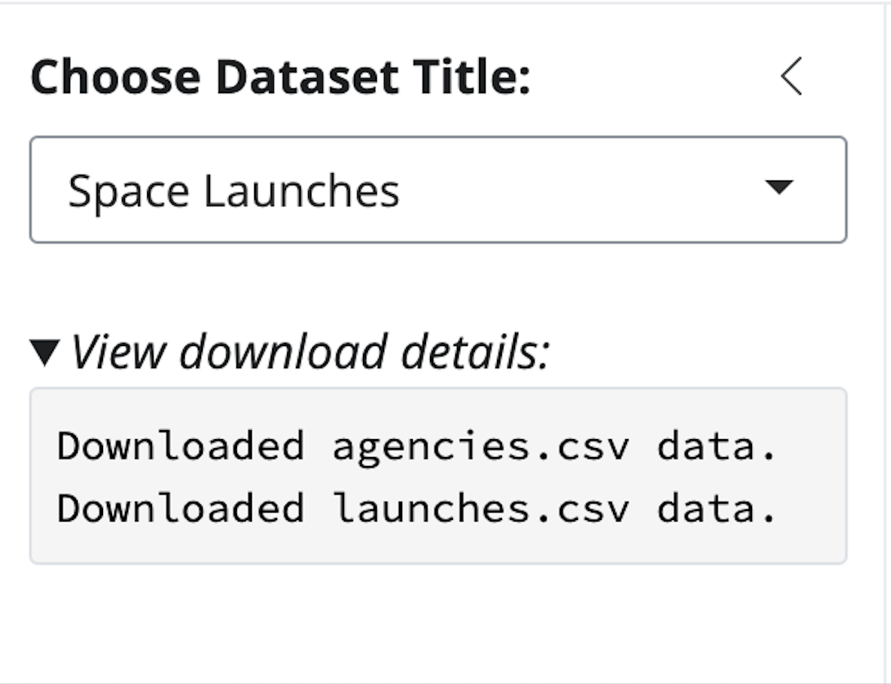
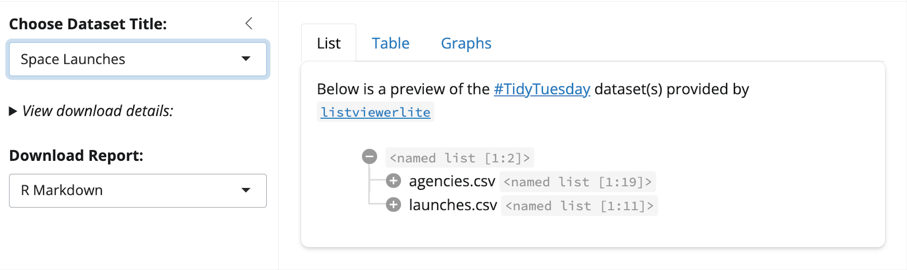
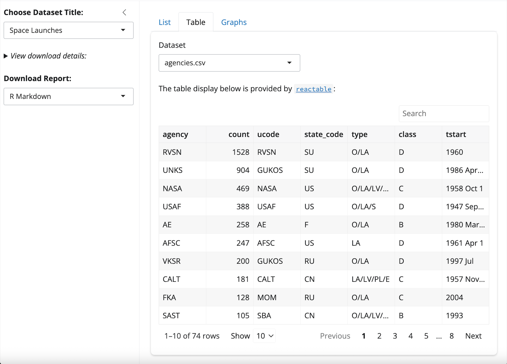
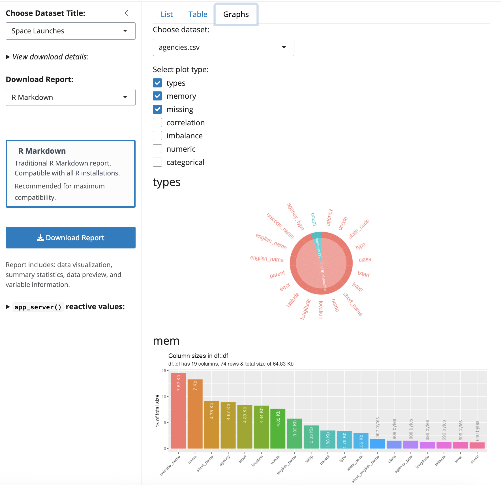
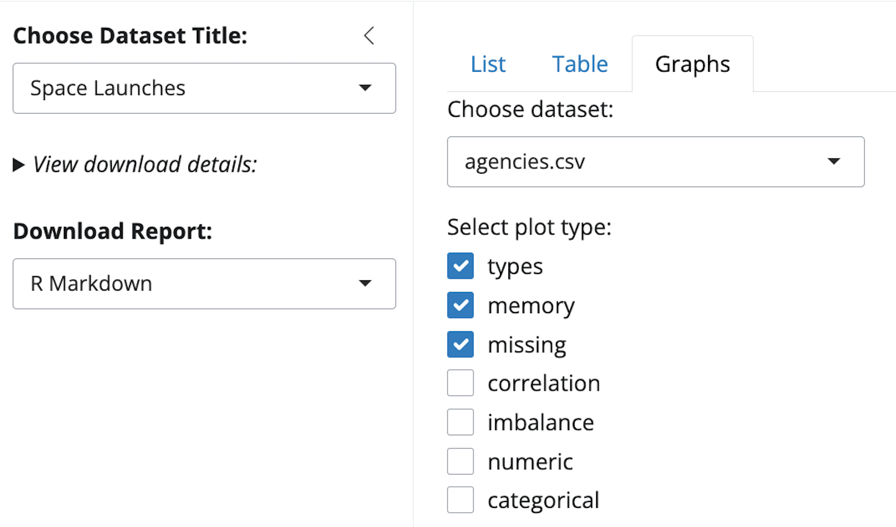

```{r}
#| label: setup
#| eval: true 
#| echo: false 
#| include: false
source("../_common.R")
options(
  scipen = 999,
  repos = c(pm = "https://packagemanager.posit.co/cran/latest",
            CRAN = "https://cloud.r-project.org")
  )
library(quarto)
library(rmarkdown)
library(shiny)
library(lobstr)
install.packages('remotes')
remotes::install_github('mjfrigaard/ttdviewer', 
  quiet = TRUE, force = TRUE)
```

```{r}
#| label: co_box_dev
#| echo: false
#| results: asis
#| eval: true
co_box(color = "r", 
  header = "DRAFT!", 
  contents = "This post is currently under development--thank you for your patience.")
```

In this post I'll cover a package/app I've been working on: [`ttdviewer`](https://mjfrigaard.github.io/ttdviewer/index.html). I designed this app to be an interactive tool for exploring the [#TidyTuesday datasets](https://github.com/rfordatascience/tidytuesday). This post will cover my experience developing this app in [Positron](https://positron.posit.co/), using the Assistant[^assistant], adjusting my LLM system prompts, and debugging the parameterized reports. 

[^assistant]: Read more about configuring [Positron Assistant](https://positron.posit.co/assistant.html).

## Objective

The entire application centers around a single UI input (i.e., dataset name) and a variety outputs with an optional downloadable report.[^tidytues] The downloadable report feature was tricky, but I think these are a great feature, so I've put together some tips I learned after debugging this feature in multiple applications. 

[^tidytues]: `load_tt_data()` joins the metadata from [`ttmeta`](https://r4ds.github.io/ttmeta/) and [`tidytuesdayR`](https://dslc-io.github.io/tidytuesdayR/).

```{r}
#| eval: true 
#| code-fold: false
library(ttdviewer)
```

### App structure

The app has the following structure and naming conventions:

1. Utility functions for loading data (`load_tt_data()`), creating graphs  (`inspect_plot()`), and rendering R Markdown and Quarto reports (`render_report()`).  
2. Modules for collecting inputs, displaying outputs, and downloading reports. All modules have a `mod_` prefix and either a `_ui()` or `_server()` suffix.  
3. Separate UI (`app_ui()`) and server (`app_server()`) functions.    
4. A standalone app function: `launch()`  

```{=html}

<style>

.codeStyle span:not(.nodeLabel) {
  font-family: monospace;
  font-size: 1.5em;
  font-weight: bold;
  color: #9753b8 !important;
  background-color: #f6f6f6;
  padding: 0.2em;
}

</style>
```

```{mermaid}
%%| fig-align: center
%%| fig-width: 8.5
%%| echo: false
%%| eval: true
%%| fig-cap: 'App/package functions'
%%{init: {'theme': 'neutral', 'look': 'neo', 'themeVariables': { 'fontFamily': 'monospace', "fontSize":"18px"}}}%%


flowchart TD
  Launch["launch()"] --> UI["app_ui()"]
  Launch --> Server["app_server()"]
  Server --> Input["mod_input_server()"]
  Input --> Data["load_tt_data()"]
  Server --> ReportInput["mod_report_input_server()"]
  ReportInput --> ReportDesc["mod_report_desc_server()"]
  ReportInput --> ReportDownload["mod_report_download_server()"]
  ReportDownload --> RenderReport["render_report()"]
  Server --> List["mod_list_server()"]
  Server --> Table["mod_table_server()"]
  Server --> Plot["mod_plot_server()"]
  Plot --> InspectPlot["inspect_plot()"]
  Data --> List
  Data --> Table
  Data --> Plot

style Server fill:#FF6B6B
style UI fill:#87CEEB
style Launch fill:#90EE90

style Input fill:#DDA0DD
style ReportInput fill:#DDA0DD
style ReportDesc fill:#DDA0DD
style ReportDownload fill:#DDA0DD
style List fill:#DDA0DD
style Table fill:#DDA0DD
style Plot fill:#DDA0DD


style Data fill:#FFD700
style RenderReport fill:#FFD700
style InspectPlot fill:#FFD700

```


:::{.column-margin}

*I used [openAI's codex](https://openai.com/codex/) to help with the `mermaid` documentation for the `ttdviewer` package.* 

:::

### Sidebar inputs 

The inputs for the dataset and report download are available in the sidebar. 

```{mermaid}
%%| fig-align: center
%%| echo: false
%%| eval: true
%%| fig-cap: 'Sidebar Inputs'
%%{init: {'theme': 'neutral', 'look': 'neo', 'themeVariables': { 'fontFamily': 'monospace', "fontSize":"12px"}}}%%

flowchart LR
  Sidebar["Sidebar inputs"] --> InputUI("mod_input_ui()")
  Sidebar --> ReportUI("mod_report_input_ui()")
  Sidebar --> ReportDescUI("mod_report_desc_ui()")
  Sidebar --> ReportDownloadUI("mod_report_download_ui()")

  style Sidebar fill:#87CEEB
  style InputUI fill:#E39C37
  style ReportUI fill:#E39C37
  
  style ReportDescUI fill:#4051B5,color:#FFFFFF
  style ReportDownloadUI fill:#4051B5,color:#FFFFFF

```

### Tab panels 

Each output is displayed in it's own tab panel. 

```{mermaid}
%%| fig-align: center
%%| echo: false
%%| eval: true
%%| fig-cap: 'App/package functions'
%%{init: {'theme': 'neutral', 'look': 'neo', 'themeVariables': { 'fontFamily': 'monospace', "fontSize":"12px"}}}%%

flowchart LR
  Tabs["Tab panels"] --> ListUI("mod_list_ui()")
  Tabs --> TableUI("mod_table_ui()")
  Tabs --> PlotUI("mod_plot_ui()")

  style Tabs fill:#90EE90
  style ListUI fill:#FF6B6B
  style TableUI fill:#FF6B6B
  style PlotUI fill:#FF6B6B

```

### Package files 

I've displayed the `R/` folder from the `ttdviewer` package  below. The code base includes a 
handful of Shiny modules, utility functions, UI and server functions, and a standalone app function. 

```{verbatim}
R/
├── app_server.R #<1>
├── app_ui.R #<1>
├── inspect_plot.R #<3>
├── launch.R #<4>
├── load_tt_data.R #<2>
├── logr_msg.R #<5>
├── mod_list.R #<6>
├── mod_report_desc.R #<6>
├── mod_report_download.R #<6>
├── mod_report_input.R #<6>
├── mod_table.R #<6>
├── mod_input.R #<6>
├── mod_viz.R #<6>
├── render_report.R # <7>
└── testthat.R # <8>

1 directory, 15 files
```
1. App functions 
2. Data utility function   
3. Plot utility function   
4. Standalone app function 
5. Logging function 
6. Shiny modules  
7. Report utilities  
8. Test utilities 

In the sections below, we'll cover how to the inputs are passed between the modules before being rendered in the downloaded report.

## Dataset input

The dataset input is used to download the dataset(s) from the [`#TidyTuesday` GitHub](https://github.com/rfordatascience/tidytuesday) repo. Other packages provide similar utilities, but I wanted `ttdviewer` to be able to reliably download *all* the #TidyTuesday datasets (not just the .csv files).[^similar-pkgs] After making a selection, the download progress is displayed (within `details()` and `summary()` tags).

[^similar-pkgs]: [tidytuesdayR](https://dslc-io.github.io/tidytuesdayR/) and [ttmeta](https://r4ds.github.io/ttmeta/) also provide #TidyTuesday datasets and information. Read more in the [documentation.](https://mjfrigaard.github.io/ttdviewer/articles/data.html)

{width='50%' fig-align='center'}


The dataset title is the reactive value passed to the remaining modules in the application.

```{r}
#| label: mod_input-ds_title-input
#| eval: false
#| code-fold: false
# in mod_input_ui()
choices <- unique(all_tt_combined$title) # <1> 
selectInput( # <2>
  inputId = ns("ds_title"),
  label = strong("Choose Dataset Title:"),
  choices = choices,
  selected = "Space Launches"
) # <2>
```
1. Dataset titles from the internal `all_tt_combined` data    
2. User input   

The title is the input argument for the `load_tt_data()` function, which downloads the data from the GitHub repo. 

```{r}
#| label: mod_input-ds_title-output
#| eval: false
#| code-fold: true 
#| code-summary: 'show/hide data() reactive'
# in mod_input_server()
data <- reactive({ 
  req(input$ds_title)
  logr_msg( #<1>
    message = paste("User selected dataset:", input$ds_title),
    level = "INFO"
    ) #<1>
  tryCatch({
      result <- load_tt_data(input$ds_title) # <2> 
      if (length(result) == 0) {
        logr_msg(
          message = "Empty dataset returned",
          level = "WARN")
        showNotification("No data available for selected dataset", # <3> 
          type = "warning", duration = 5
        ) # <3> 
      } else {
        logr_msg(
          message = "Dataset successfully loaded in reactive",
          level = "SUCCESS"
          )
      }
      return(result)
    },
    error = function(e) { # <4>
      logr_msg(
        message = paste("Error in data reactive:", e$message),
        level = "ERROR"
        )
      showNotification(paste("Error loading data:", e$message),
        type = "error", duration = 10
      )
      return(list())
    }) # <4>
}) |>
  bindEvent(input$ds_title) 
```
1. [`logr_msg()`](https://github.com/mjfrigaard/ttdviewer/blob/main/R/logr_msg.R) is a custom logging function using the [`logger` package](https://daroczig.github.io/logger/).   
2. Reactive `data()` list is created from [`load_tt_data()` function](https://github.com/mjfrigaard/ttdviewer/blob/main/R/load_tt_data.R).      
3. Notification for unavailable data    
4. Graceful error handling    

A demo of `load_tt_data()` is below:

:::{.column-margin}

*`ttd` is a named list with however many datasets the title refers to.*

:::

```{r}
#| label: load_tt_data_ttd
#| eval: true 
#| message: false 
#| warning: false
#| echo: true 
#| code-fold: false
ttd <- load_tt_data("Space Launches")
```

```{r}
#| label: str_ttd
#| eval: true 
#| collapse: true
#| message: false 
#| warning: false
#| echo: true 
#| code-fold: true
#| code-summary: 'show/hide ttd structure'
str(ttd)
```

## Modules 

Below is an abstract syntax tree[^ast] for the inputs (i.e., the dataset title and downloadable report format) and display modules (list, table, and graphs).

```{r}
#| eval: false  
#| include: false
#| echo: false
#| comment: ""
ast(
  launch(
    app_ui(
      mod_input_ui(),
      mod_list_ui(),
      mod_plot_ui(),
      mod_table_ui(),
      mod_report_input_ui(),
      mod_report_desc_ui(),
      mod_report_download_ui()
    ),
    app_server(
      mod_input_server(),
      mod_list_server(),
      mod_table_server(),
      mod_plot_server(),
      mod_report_input_server(),
      mod_report_desc_server(),
      mod_report_download_server()
    )
  )
)
```

```{verbatim}
█─launch
├─█─app_ui 
│ ├─█─mod_input_ui 
│ ├─█─mod_list_ui 
│ ├─█─mod_plot_ui 
│ ├─█─mod_table_ui 
│ ├─█─mod_report_input_ui 
│ ├─█─mod_report_desc_ui 
│ └─█─mod_report_download_ui 
└─█─app_server 
  ├─█─mod_input_server 
  ├─█─mod_list_server 
  ├─█─mod_table_server 
  ├─█─mod_plot_server 
  ├─█─mod_report_input_server 
  ├─█─mod_report_desc_server 
  └─█─mod_report_download_server 
```

[^ast]: Compliments of the [`lobstr::ast()`](https://lobstr.r-lib.org/reference/ast.html) function.

### List display

On the first tab, the selected data is displayed using the  [`listviewerlite` package](https://long39ng.github.io/listviewerlite/).




The modules and utility function are displayed in the syntax tree below:

```{r}
#| eval: false 
#| echo: false
#| comment: ""
ast(
  launch(
    app_ui(
      mod_input_ui(),
      mod_list_ui()
    ),
    app_server(
      mod_input_server(
        load_tt_data()
      ),
      mod_list_server()
    )
  )
)
```

```{verbatim}
█─launch 
├─█─app_ui 
│ ├─█─mod_input_ui 
│ └─█─mod_list_ui 
└─█─app_server 
  ├─█─mod_input_server 
  │ └─█─load_tt_data 
  └─█─mod_list_server 
```

`mod_list` includes help text and graceful error handling with a clear message if the UI fails:

```{r}
#| label: mod_list-input
#| eval: false
#| code-fold: true 
#| code-summary: 'show/hide mod_list module'
  tryCatch({
      bslib::card(
        bslib::card_body(
          markdown("Below is a preview of the [#TidyTuesday](https://github.com/rfordatascience/tidytuesday) 
            dataset(s) provided by [`listviewerlite`](https://long39ng.github.io/listviewerlite/)"),
          uiOutput(ns("list"))
        )
      )
    },
    error = function(e) {
      logr_msg(
        message = paste("Error creating list UI:", e$message),
        level = "ERROR")
      bslib::card(
        bslib::card_header("List Error"),
        bslib::card_body(
          h4("Error loading list interface", class = "text-danger")
        )
      )
    })
```


The output is rendered with a `renderUI()` and displays the reactive `data()` list:

```{r}
#| label: mod_list-output
#| eval: false
#| code-fold: false
output$list <- renderUI({
  req(data())
  listviewerlite::listview(data())
})
```

```{r}
#| label: listviewerlite
#| eval: true 
#| echo: false
listviewerlite::listview(ttd)
```

The `data` and reactive `ds_title` are returned from the server function. 

```{r}
#| label: mod_input-return
#| eval: false
#| code-fold: false
    return( 
        list(
          data = data,
          'ds_title' = reactive(input$ds_title)
        )
      ) 
```

### Table display

The second tab in the application contains a table display of the selected data from the sidebar. 



The input is collected from the `mod_input` (just like the list display above). By default, the tab loads with the first element in the list.

```{r}
#| eval: false 
#| echo: false
#| comment: ""
ast(
  launch(
    app_ui(
      mod_input_ui(),
      mod_table_ui()
    ),
    app_server(
      mod_input_server(
        load_tt_data()
      ),
      mod_table_server()
    )
  )
)
```

```{verbatim}
█─launch 
├─█─app_ui 
│ ├─█─mod_input_ui 
│ └─█─mod_table_ui 
└─█─app_server 
  ├─█─mod_input_server 
  │ └─█─load_tt_data 
  └─█─mod_table_server 
```


`mod_input_server()` returns a reactive list with the data (as `selected_data`), which is passed to `mod_table_server()`:


```{r}
#| label: app_server-table
#| eval: false
#| code-fold: false 
# in app_server()
title_input <- mod_input_server("input") #<1>

selected_data <- title_input$data #<2>

mod_table_server(id = "table", data = selected_data) #<3>
```
1. Initialize modules   
2. Return the data and title    
3. Reactive values for table    

Inside `mod_table_server()`, the selected dataset (`input$ds_input`) is subsetted from the reactive list:

```{r}
#| label: safe-table
#| eval: false 
#| code-fold: true 
#| code-summary: 'show/hide ds_list'
tryCatch({
    req(data())
    if (length(data()) == 0) {
      logr_msg(
        message = "No data available for table rendering",
        level = "WARN")
      return(NULL)
    }
    ds_list <- data() #<1>

    ds_selected <- as.character(input$ds_input) #<2>
    display_ds <- ds_list[[ds_selected]]  #<3>
}, error = function(e) {
  logr_msg(
    message = paste("Error rendering table:", e$message),
    level = "ERROR")
    # return empty reactable with error message
    reactable::reactable(
      data.frame(Error = paste("Failed to load data:", e$message)),
      searchable = FALSE,
      sortable = FALSE,
      pagination = FALSE)
})
```
1. Rename `data()` reactive     
2. Selected dataset from UI input        
3. Subset single dataset from list      

The single dataset (`display_ds`) is passed through conditional logic to ensure large datasets aren't rendered in the application:

```{r}
#| label: table-large-data
#| eval: false
#| code-fold: true 
#| code-summary: 'show/hide display_ds'
# limit to first 1000 rows
display_ds <- if (nrow(display_ds) > 1000) {
  logr_msg(
    message = "Large dataset detected - limiting to first 1000 rows",
    level = "INFO")
  head(display_ds, 1000)
} else {
  display_ds
}
```

Finally, the data is passed to `renderReactable()` with the following table settings: 

```{r}
#| label: render-reactable
#| eval: true 
#| code-fold: show 
#| code-summary: 'show/hide reactable code'
reactable::reactable(
            ttd[[1]], #<1>
            searchable = TRUE,
            sortable = TRUE,
            pagination = TRUE,
            defaultPageSize = 10,
            showPageSizeOptions = TRUE,
            pageSizeOptions = c(5, 10, 20, 50),
            highlight = TRUE,
            bordered = TRUE,
            striped = TRUE,
            resizable = TRUE,
            wrap = FALSE,
            defaultColDef = reactable::colDef(
              minWidth = 100,
              headerStyle = list(background = "#f7f7f8")
            )
          )
```
1. Subsetted data from the reactive list  


### Graph display

The third tab display graphs for the selected [#TidyTuesday data](https://github.com/rfordatascience/tidytuesday) compliments of the 
[`inspectdf` package](https://github.com/alastairrushworth/inspectdf/tree/master), which provides "*collection of utilities for columnwise summary, comparison and visualisation of data frames.*"



The `mod_plot` module uses the same reactive input from `mod_input` as the `mod_list` and `mod_table`:

```{r}
#| eval: false 
#| echo: false
#| comment: ""
ast(
  launch(
    app_ui(
      mod_input_ui(),
      mod_plot_ui()
    ),
    app_server(
      mod_input_server(
        load_tt_data()
      ),
      mod_plot_server(
        inspect_plot()
      )
    )
  )
)
```

```{verbatim}
█─launch 
├─█─app_ui 
│ ├─█─mod_input_ui 
│ └─█─mod_plot_ui 
└─█─app_server 
  ├─█─mod_input_server 
  │ └─█─load_tt_data 
  └─█─mod_plot_server 
    └─█─inspect_plot
```

The UI contains a dropdown input for choosing a `dataset` and checkboxes for selecting `plots`, which are rendered via `uiOutput()`:

```{r}
#| label: mod_plot-inputs
#| eval: false 
#| code-fold: true 
#| code-summary: 'show/hide graph inputs'
ns <- NS(id) #<1>
tagList(
  selectInput( #<2>
    ns("dataset"),
    "Choose dataset:",
    choices = NULL,
    selected = NULL
  ), #<2>
  checkboxGroupInput( #<3>
    ns("plots"),
    "Select plot type:",
    choices = c(
      "types"       = "types",
      "memory"      = "mem",
      "missing"     = "na",
      "correlation" = "cor",
      "imbalance"   = "imb",
      "numeric"     = "num",
      "categorical" = "cat"
    ),
    selected = c("types","mem","na")
  ), #<3>
  uiOutput(ns("plots_ui"))  #<4>
)
```
1. Namespace (for connecting modules)    
2. Dataset input (from selected #TidyTuesday data in sidebar)    
3. Plots selected from [`inspectdf` package](https://alastairrushworth.com/inspectdf/)     
4. Plot outputs    

{width='75%' fig-align='center'}

Inside `mod_plot_server()`, I've written `inspect_plot()`, which combines the `inspect_*()` + `show_plot()` functions from `inspectdf` and returns the corresponding plot. 

```{r}
#| label: observe-inspect_plot
#| eval: false 
#| code-fold: true 
#| code-summary: 'show/hide inspect_plot()'
observe({
    tryCatch({
      ds_list <- req(ttd_r())
      sel_ds  <- input$dataset #<1>
      req(sel_ds %in% names(ds_list))  
      df <- ds_list[[sel_ds]] #<2>
      logr_msg(
        message = sprintf("Rendering plots for dataset '%s'", sel_ds),
        level = "INFO")

      purrr::walk(input$plots, function(plt) { #<3>
        out_id <- paste0("plt_", plt)
        output[[out_id]] <- renderPlot({
          tryCatch({
            inspect_plot(
              ttd = setNames(list(df), sel_ds),
              plots = plt
            )
          }, error = function(err2) {
            logr_msg(
              message = sprintf("Error plotting %s:%s — %s",
                sel_ds, plt, err2$message),
              level = "ERROR")
            plot.new() #<4> 
            text(0.5, 0.5, "Error generating plot", cex = 1.2, col = "red") #<4> 
          })
        })
      }) #<3>
    }, error = function(err) {
      logr_msg(
        message = sprintf("Error in plot observer: %s", err$message),
        level = "ERROR")
    })
  }) |>
  bindEvent(list(input$dataset, input$plots),
            ignoreNULL = TRUE)
```
1. Selected dataset from UI   
2. Extract dataset from list (`ds_list`)    
3. Iterate over plot inputs (`input$plots`)  
4. Display placeholder    

`inspect_plot()` has to be called for each plot selected with `input$plots`, so `purrr::walk()` allows us to iterate through the plots selected via the `checkboxGroupInput()` in `mod_plot_ui()`:

The output (`plots_ui`) is rendered with `renderUI()` and once again we use `purrr::map()` to iterate through the `input$plots` selections, create namespaced `outputIds`, and titles for each plot. 

```{r}
#| label: render-plot-inspect_plot
#| eval: false 
#| code-fold: true 
#| code-summary: 'show/hide plot_ui'
output$plots_ui <- renderUI({
  tryCatch({
    req(input$dataset, input$plots) #<1>
    
    logr_msg(message =
        sprintf("Rendering UI for dataset '%s' and plots: %s",
                 input$dataset,
                 paste(input$plots, collapse = ", ")),
             level = "DEBUG")

    purrr::map(input$plots, function(plt) { #<2>
      plot_id <- ns(paste0("plt_", plt))
      tagList(
        h4(plt),
        plotOutput(plot_id, height = "300px")
      )
    }) #<2>
    
  }, error = function(err) { #<3>
    logr_msg(
      message = sprintf("Error in plots_ui renderUI: %s", err$message),
      level = "ERROR")
    tagList(
      p(style = "color:red;", "Failed to generate plot UI.")
    )
  }) #<3>
})
```
1. Require the `dataset` and `plots` inputs   
2. Iterate through the selected plot types and create headers and outputs   
3. Safely generate errors if plots fail     

By default, the application creates plots for the variable types, memory, and missing: 

```{r}
#| label: inspect_plot_ttd
#| code-fold: false
#| eval: true 
#| message: true 
#| warning: true
inspect_plot(
  ttd = list("agencies.csv" = ttd[[1]]), # <1>
  plots = c("types", "mem", "na")
)
```
1. The `ttd` argument is meant to contain a list object returned from the `load_tt_data()` function, so to plot the graphs for a single dataset we need to wrap it in a named list. 

## Reports

The downloadable reports need to contain everything the user can see in the application (the list display with `listviewerlite`, the `reactable` table, and the graphs generated with `inspectdf`). To accomplish this, we need to make sure each module returns the objects they render. 

### Report modules

There are three modules for handling the downloadable reports: `mod_report_input` collects the selected format, `mod_report_desc` displays a description of the selected format in the UI, and `mod_report_download` renders and downloads the report.

```{r}
#| eval: false 
#| echo: false
#| comment: ""
ast(
  launch(
    app_ui(
      mod_input_ui(),
      mod_report_input_ui(),
      mod_report_desc_ui(),
      mod_report_download_ui()
    ),
    app_server(
      mod_input_server(
        load_tt_data()
      ),
      mod_report_input_server(),
      mod_report_desc_server(),
      mod_report_download_server()
    )
  )
)
```

```{verbatim}
█─launch 
├─█─app_ui 
│ ├─█─mod_input_ui 
│ ├─█─mod_report_input_ui 
│ ├─█─mod_report_desc_ui 
│ └─█─mod_report_download_ui 
└─█─app_server 
  ├─█─mod_input_server 
  │ └─█─load_tt_data 
  ├─█─mod_report_input_server 
  ├─█─mod_report_desc_server 
  └─█─mod_report_download_server 
```

#### Report input

```{r}
#| label: mod_input_ui
#| eval: false

```

```{r}
#| label: mod_input_server
#| eval: false
```


#### Report description 

```{r}
#| label: mod_report_desc_ui
#| eval: false
```

```{r}
#| label: mod_report_desc_server
#| eval: false
```

#### Report download 

```{r}
#| label: mod_report_download_ui
#| eval: false
```

```{r}
#| label: mod_report_download_server
#| eval: false
```

#### Download handler

##### filename

##### content

#### render_report()

The `render_report()` utility function controls the template used when the download button is clicked:

```{r}
#| eval: false 
#| echo: false
#| comment: ""
ast(
mod_report_server(
  render_report(
    get_template_path(),
    create_fallback_template(
      create_fallback_rmd_template(),
      create_fallback_qmd_template()
    ),
    render_rmarkdown_report(),
    render_quarto_report()
    ),
  create_error_report()
  )
)
```

```{verbatim}
█─mod_report_server 
├─█─render_report 
│ ├─█─get_template_path 
│ ├─█─create_fallback_template 
│ │ ├─█─create_fallback_rmd_template 
│ │ └─█─create_fallback_qmd_template 
│ ├─█─render_rmarkdown_report 
│ └─█─render_quarto_report 
└─█─create_error_report 
```

```{r}
#| label: render_report
#| eval: false
```

#### Templates 

We'll store the report templates in the `inst/` folder. Anything in `inst/` automatically included and accessible from an installed application with `system.file()`, so it's a great place for template files. 

The templates are accessed with the `get_template_path()` function. The `get_template_path()` function returns the installed location of our templates: 

```{verbatim}
└── inst
    └── rmarkdown
        └── report_template.Rmd
```

```{r}
#| label: get_template_path_rmd
#| eval: false
#| code-fold: false
identical(
  # response from function
  x = get_template_path('rmarkdown'), 
  # response from system.file()
  y = system.file("rmarkdown", "report_template.Rmd", 
                  package = "ttdviewer"))
#  [1] TRUE
```

```{verbatim}
└── inst
    └── quarto
        └── report_template.qmd
```

```{r}
#| label: get_template_path_qmd
#| eval: false
#| code-fold: false
identical(
  # response from function
  x = get_template_path('quarto'), 
  # response from system.file()
  y = system.file("quarto", "report_template.qmd", 
                  package = "ttdviewer"))
#  [1] TRUE
```

#### Fallback templates 

```{r}
#| label: rmd_create_fallback_template
#| eval: false
#| code-fold: false
rmd_temp <- create_fallback_template(format = "rmarkdown")
basename(rmd_temp)
#  [1] "file4f125a69628c.Rmd"
```


```{r}
#| label: qmd_create_fallback_template
#| eval: false
#| code-fold: false
qmd_temp <- create_fallback_template(format = "quarto")
basename(qmd_temp)
#  [1] "file4f1227ef5f57.qmd"
```


### Reactives and params

### R Markdown params

### Quarto params


