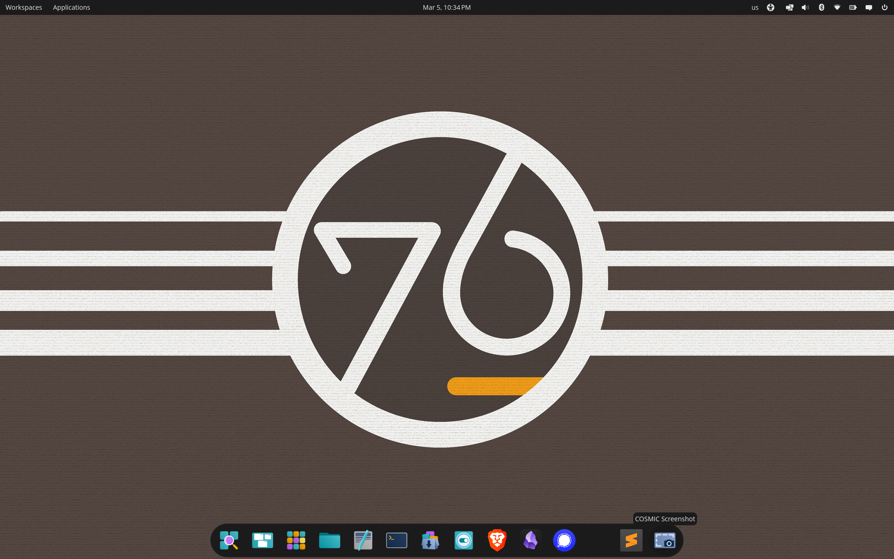
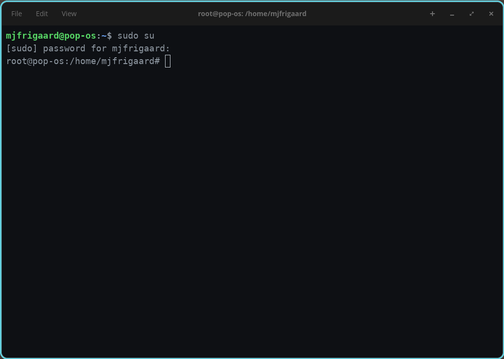
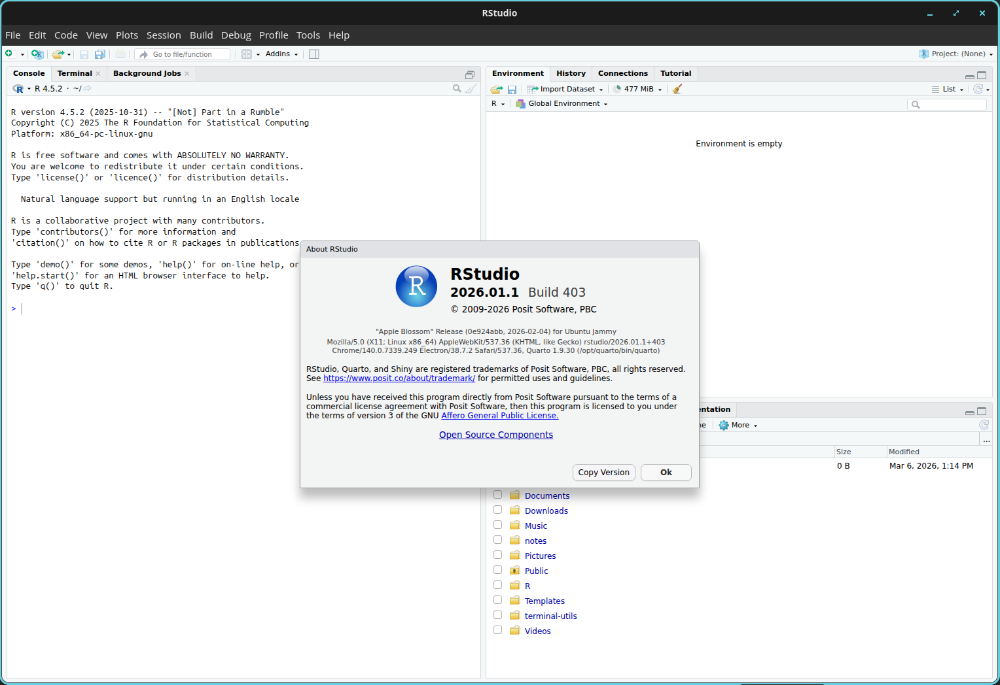
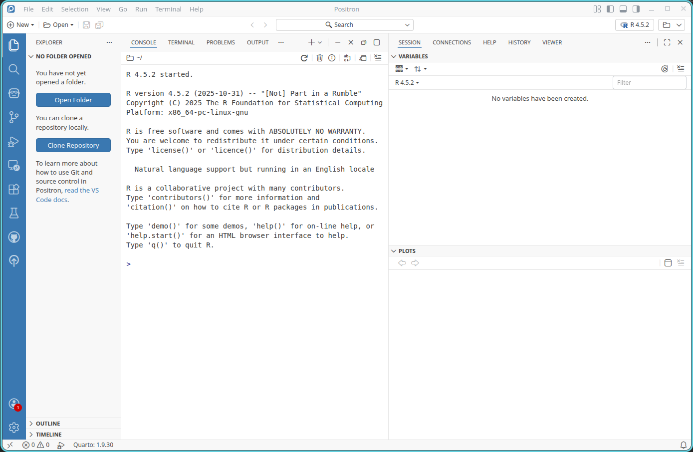
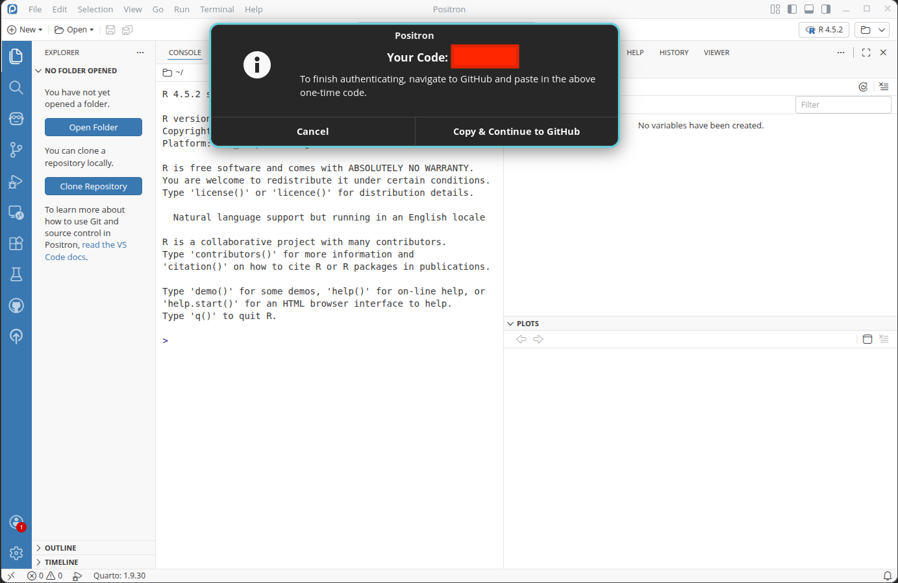

```{r}
#| label: setup
#| eval: true 
#| echo: false 
#| include: false
source("../_common.R")
options(
  scipen = 999,
  repos = c(pm = "https://packagemanager.posit.co/cran/latest",
            CRAN = "https://cloud.r-project.org")
  )
library(quarto)
library(rmarkdown)
library(shiny)
library(lobstr)
```

```{r}
#| label: co_box_dev
#| echo: false
#| results: asis
#| eval: false
co_box(color = "r", 
  header = "DRAFT!", 
  contents = "This post is currently under development--thank you for your patience.")
```


I recently purchased a [System76](https://system76.com/) laptop, which comes with their own Linux operating system: [Pop!\_OS](https://system76.com/pop/). This post covers installing R, Python, and Quarto and setting up RStudio and Positron. 

## The COSMIC Desktop Environment 

[Pop!\_OS](https://github.com/pop-os/cosmic-epoch) features the COSMIC  (it previous used GNOME), a fully custom Rust-based desktop environment. COSMIC is built on Ubuntu, meaning it uses the same package ecosystem (`.deb` packages and `apt` package manager). Read more about the OS on the [System76 website.](https://system76.com/pop/)

{width='100%' fig-align='center'}

### The COSMIC Terminal 

[Pop!\_OS](https://github.com/pop-os/cosmic-epoch) ships with the [COSMIC Terminal](https://github.com/pop-os/cosmic-term), which is also written entirely in Rust. 

{width='100%' fig-align='center'}

Using any flavor of Ubuntu typically means getting comfortable using the Terminal, and we can start by confirming the `$XDG_CURRENT_DESKTOP`:

```{bash}
#| eval: false 
#| code-fold: false
echo $XDG_CURRENT_DESKTOP
```

```{bash}
#| eval: false 
#| code-fold: false
COSMIC
```

[Pop!\_OS](https://github.com/pop-os/cosmic-epoch) uses Ubuntu 24, which you can discover using: 

```{bash}
#| eval: false 
#| code-fold: false
cat /etc/os-release
```

```{bash}
#| eval: false 
#| code-fold: false
NAME="Pop!_OS"
VERSION="24.04 LTS"
ID=pop
ID_LIKE="ubuntu debian"
PRETTY_NAME="Pop!_OS 24.04 LTS"
VERSION_ID="24.04"
HOME_URL="https://pop.system76.com"
SUPPORT_URL="https://support.system76.com"
BUG_REPORT_URL="https://github.com/pop-os/pop/issues"
PRIVACY_POLICY_URL="https://system76.com/privacy"
VERSION_CODENAME=noble
UBUNTU_CODENAME=noble
LOGO=distributor-logo-pop-os
```

```{r}
#| label: co_box_uname
#| echo: false
#| results: asis
#| eval: true
co_box(color = "g", 
  header = "Checking the hardware platform", 
  fold = TRUE,
  contents = "
The `uname` command returns information on the hardware platform and architecture: 

- `uname` alone returns just the kernel name (e.g., `Linux`)

- `uname -i` returns the **hardware platform** (e.g., `x86_64`), indicating the CPU architecture

")
```

<br>

The COSMIC Desktop Environment is still in active development, but we can check the current installed version with:

```{bash}
#| eval: false 
#| code-fold: false
cosmic-term --version
```

```{bash}
#| eval: false 
#| code-fold: false
cosmic-term 1.0.8
```

Below I'll cover installing and configuring R, Python, and Quarto. Most of these instructions can be found from Posit,[^posit-docs] but I've included additional details here (and any deviations from the official documentation).

[^posit-docs]: Posit has documentation for installing [R](https://docs.posit.co/resources/install-r.html), [Python](https://docs.posit.co/resources/install-python-uv.html), and [Quarto](https://docs.posit.co/resources/install-quarto.html) on most operating systems.

## R 

I installed R following the Ubuntu instructions from [CRAN](https://cloud.r-project.org/bin/linux/ubuntu/#cb2-3).

First we refresh the list of available packages from all `apt` configured repos:   
```{bash}
#| eval: false 
#| code-fold: false
apt update -qq
```

:::{.column-margin}

The `-qq` ("quiet" mode) flag suppresses most of the output. 

:::
    
```{bash}
#| eval: false 
#| code-fold: false
3 packages can be upgraded. Run 'apt list --upgradable' to see them.
```

Next we install prerequisite tools:

```{bash}
#| eval: false 
#| code-fold: false
apt install --no-install-recommends software-properties-common dirmngr
```

:::{.column-margin}

- `--no-install-recommends` only installs the required dependencies. 

- `dirmngr` handles secure key management for verifying package signatures in the following step.

:::

```{bash}
#| eval: false 
#| code-fold: false
Reading package lists... Done
Building dependency tree... Done
Reading state information... Done
software-properties-common is already the newest version (0.99.49.4).
dirmngr is already the newest version (2.4.4-2ubuntu17.4).
The following packages were automatically installed and are no longer required:
  libframe6 libgeis1 libgrail6 libllvm19 libqt5x11extras5 libqt5xml5t64 touchegg
Use 'sudo apt autoremove' to remove them.
0 upgraded, 0 newly installed, 0 to remove and 3 not upgraded.
```

The commands below will download and store CRAN's cryptographic public key (_the comments give instructions for verification_).

```{bash}
#| eval: false 
#| code-fold: false
# add the signing key (by Michael Rutter) for these repos
# To verify key, run gpg --show-keys /etc/apt/trusted.gpg.d/cran_ubuntu_key.asc 
# Fingerprint: E298A3A825C0D65DFD57CBB651716619E084DAB9
```

```{bash}
#| eval: false 
#| code-fold: false
wget -qO- https://cloud.r-project.org/bin/linux/ubuntu/marutter_pubkey.asc | tee -a /etc/apt/trusted.gpg.d/cran_ubuntu_key.asc
```

:::{.column-margin}

The signing key allows `apt` to verify R packages we download from CRAN are authentic.

:::

You'll see the PGP key in the Terminal:

```{bash}
#| eval: false 
#| code-fold: false
-----BEGIN PGP PUBLIC KEY BLOCK-----
... key ...
-----END PGP PUBLIC KEY BLOCK-----
```

Next we add CRAN's R 4.0+ repo to the system's package sources with `add-apt-repository`. 

```{bash}
#| eval: false 
#| code-fold: false
add-apt-repository "deb https://cloud.r-project.org/bin/linux/ubuntu $(lsb_release -cs)-cran40/"
```


```{r}
#| label: co_box_lsb_release
#| echo: false
#| results: asis
#| eval: true
co_box(color = "g", 
  header = "What is my Ubuntu codename?", 
  fold = TRUE,
  contents = "
Including `$(lsb_release -cs)` dynamically inserts our Ubuntu codename:

\`\`\`bash
echo $(lsb_release -cs)
\`\`\`

\`\`\`bash
noble
\`\`\`

")
```

<br>

Finally, we install R from the CRAN repo we added in the step above.

```{bash}
#| eval: false 
#| code-fold: false
sudo apt install --no-install-recommends r-base
```

:::{.column-margin}

We use the `--no-install-recommends` flag again to keep the dependencies lean

:::

Check R version

```{bash}
#| eval: false 
#| code-fold: false
R --version
```

```{bash}
#| eval: false 
#| code-fold: false
R version 4.5.2 (2025-10-31) -- "[Not] Part in a Rumble"
Copyright (C) 2025 The R Foundation for Statistical Computing
Platform: x86_64-pc-linux-gnu

R is free software and comes with ABSOLUTELY NO WARRANTY.
You are welcome to redistribute it under the terms of the
GNU General Public License versions 2 or 3.
For more information about these matters see
https://www.gnu.org/licenses/.
```

## Python

Below is an adaptation of the installation instructions from [Posit](https://docs.posit.co/resources/install-python-uv.html) (using `uv`). [Pop!\_OS](https://github.com/pop-os/cosmic-epoch) comes with Python installed at the system level, and we'll want this sepatated from the `uv` installations (more about this below).

Start by installing the `uv` installer scrip. 

```{bash}
#| eval: false 
#| code-fold: false
curl -LsSf https://astral.sh/uv/install.sh | sh   
```

:::{.column-margin}

- The four `curl` flags are used to:    
    - `-L`: follow redirect
    - `-s`: silent mode
    - `-S`: show error (if they occur)
    - `-f`: fail on server errors
    
:::

The output is below:

```{bash}
#| eval: false 
#| code-fold: false
downloading uv 0.10.8 x86_64-unknown-linux-gnu
no checksums to verify
installing to /root/.local/bin
  uv
  uvx
everything's installed!

To add $HOME/.local/bin to your PATH, either restart your shell or run:

    source $HOME/.local/bin/env (sh, bash, zsh)
    source $HOME/.local/bin/env.fish (fish)
```

The output confirms `uv` and `uvx` (a tool runner) are installed to `/root/.local/bin`.

The commands below will reload the shell configuration, which adds the installed location of `uv` (`/root/.local/bin`) to our `PATH`,  making it accessible as a command. 

```{bash}
#| eval: false 
#| code-fold: false
source ~/.bashrc  # or ~/.zshrc if using zsh   
```

We can confirm it with:    

```{bash}
#| eval: false 
#| code-fold: false
uv --version   
```

```{bash}
#| eval: false 
#| code-fold: false
uv 0.10.8
```

Now we can use `uv` to install Python 3.12.4, which manages its own Python installations independently of the system Python. 

```{bash}
#| eval: false 
#| code-fold: false
uv python install 3.12.4
```

List the installed Python versions:

```{bash}
#| eval: false 
#| code-fold: false
uv python list --only-installed
```

```{bash}
#| eval: false 
#| code-fold: false
cpython-3.12.4-linux-x86_64-gnu    /root/.local/bin/python3.12 -> /root/.local/share/uv/python/cpython-3.12.4-linux-x86_64-gnu/bin/python3.12
cpython-3.12.4-linux-x86_64-gnu    /root/.local/share/uv/python/cpython-3.12-linux-x86_64-gnu/bin/python3.12
cpython-3.12.3-linux-x86_64-gnu    /usr/bin/python3.12
cpython-3.12.3-linux-x86_64-gnu    /usr/bin/python3 -> python3.12
```

```{r}
#| label: co_box_uv_py_versions
#| echo: false
#| results: asis
#| eval: true
co_box(color = "b", 
  header = "Installed Python version and locations", 
  fold = TRUE,
  contents = "

The following Python versions are installed:    

1. **`/usr/bin/python3`** = System Python (version 3.12.3), managed by `apt`   

2. **`/root/.local/share/uv/python/`** = `uv` Python (3.12.4), is managed by `uv`  

These installations are kept **completely separate**, a benefit and key safety feature of `uv`

")
```

<br>

Locate where the Python 3.12.4 binary (in case we need to explicitly point tools or virtual environments to a specific Python version).

```{bash}
#| eval: false 
#| code-fold: false
uv python find 3.12.4
```

```{bash}
#| eval: false 
#| code-fold: false
/root/.local/share/uv/python/cpython-3.12.4-linux-x86_64-gnu/bin/python3.12
```

## Quarto 

I used the following steps to install Quarto. Consult the [documentation](https://quarto.org/docs/get-started/) for more information. 

Start by downloading the latest Quarto `.deb` package from the [Quarto releases page](https://github.com/quarto-dev/quarto-cli/releases). 

Install it with:

```{bash}
#| eval: false 
#| code-fold: false
# change to Downloads folder with
# cd Downloads
sudo dpkg -i quarto-*.deb
```

```{bash}
#| eval: false 
#| code-fold: false
Selecting previously unselected package quarto.
(Reading database ... 263906 files and directories currently installed.)
Preparing to unpack quarto-1.9.30-linux-amd64.deb ...
Unpacking quarto (1.9.30) ...
Setting up quarto (1.9.30) ...
```

### Initial check

Check the `quarto` installation and dependencies with:

```{bash}
#| eval: false 
#| code-fold: false
quarto check
```

```{bash}
#| eval: false 
#| code-fold: true 
#| code-summary: 'show/hide initial  check'
Quarto 1.9.30
[✓] Checking environment information...
      Quarto cache location: /root/.cache/quarto
[✓] Checking versions of quarto binary dependencies...
      Pandoc version 3.8.3: OK
      Dart Sass version 1.87.0: OK
      Deno version 2.4.5: OK
      Typst version 0.14.2: OK
[✓] Checking versions of quarto dependencies......OK
[✓] Checking Quarto installation......OK
      Version: 1.9.30
      Path: /opt/quarto/bin

[✓] Checking tools....................OK
      TinyTeX: (not installed)
      Chromium: (not installed)
      Chrome Headless Shell: (not installed)
      VeraPDF: (not installed)

[✓] Checking LaTeX....................OK
      Tex:  (not detected)

[✓] Checking Chrome Headless....................OK
      Chrome:  (not detected)

[✓] Checking basic markdown render....OK

[✓] Checking R installation...........OK
      Version: 4.5.2
      Path: /usr/lib/R
      LibPaths:
        - /usr/local/lib/R/site-library
        - /usr/lib/R/site-library
        - /usr/lib/R/library
      knitr: (None)
      rmarkdown: (None)

      The knitr package is not available in this R installation.
      Install with install.packages("knitr")
      The rmarkdown package is not available in this R installation.
      Install with install.packages("rmarkdown")

[✓] Checking Python 3 installation....OK
      Version: 3.12.3
      Path: /usr/bin/python3
      Jupyter: (None)

      Jupyter is not available in this Python installation.
      Install with python3 -m pip install jupyter

[✓] Checking Julia installation...
```

We can see there are a few items to address. Fortunately Quarto also has commands for installing these directly:

### TinyTex

The `tools` section lists four missing dependencies:

```{bash}
#| eval: false 
#| code-fold: false
TinyTeX: (not installed)
Chromium: (not installed)
Chrome Headless Shell: (not installed)
VeraPDF: (not installed)
```

We will address the TinyTex installation first with `quarto`

```{bash}
#| eval: false 
#| code-fold: false
quarto install tinytex
```

```{bash}
#| eval: false 
#| code-fold: false
Installing tinytex
[✓] Downloading TinyTex v2026.03.02
[✓] Unzipping TinyTeX-v2026.03.02.tar.gz
[✓] Moving files
[✓] Verifying tlgpg support
[✓] Configuring font paths
[✓] Default Repository: https://mirrors.ibiblio.org/pub/mirrors/CTAN/systems/texlive/tlnet/
Installation successful
```
### Chromium

`Chrome:  (not detected)`: we can fix this by installing chromium with `quarto`

```{bash}
#| eval: false 
#| code-fold: false
quarto install chromium
```

```{bash}
#| eval: false 
#| code-fold: false
Installing chromium
[✓] Downloading Chromium 869685
[✓] Installing Chromium 869685
Installation successful
```

### knitr and rmarkdown

The R installation lists the knitr and rmarkdown packages as missing:

```{bash}
#| eval: false 
#| code-fold: false
knitr: (None)
rmarkdown: (None)
```

We can install these from the COSMIC Terminal by launching R:

```{bash}
#| eval: false 
#| code-fold: false
R
```

Install the packages as you would in RStudio or Positron:

```{r}
#| eval: false 
#| code-fold: false
install.packages(c("knitr", "rmarkdown"))
```

Exit R:

```{r}
#| eval: false 
#| code-fold: false
quit()
```

These are now installed at the system-level.

### Python 3 installation

The Python 3 installation is fine, but Quarto is currently detecting the **system Python** (`/usr/bin/python3`). We want to create a dedicated virtual environment for Quarto's Jupyter dependency.

Use `uv` to create a dedicated virtual environment for Quarto:

```{bash}
#| eval: false 
#| code-fold: false
uv venv ~/.quarto-venv --python 3.12.4
```

```{bash}
#| eval: false 
#| code-fold: false
Using CPython 3.12.4
Creating virtual environment at: /root/.quarto-venv
Activate with: source /root/.quarto-venv/bin/activate
```

Activate the virtual environment:

:::{.column-margin}

*This changes the Terminal from...*

```{bash}
#| eval: false 
#| code-fold: false
root@pop-os:/#
```

*to...*

```{bash}
#| eval: false 
#| code-fold: false
(.quarto-venv) root@pop-os:/#
```

:::

```{bash}
#| eval: false 
#| code-fold: false
source ~/.quarto-venv/bin/activate
```

Install Jupyter into the virtual environment using `uv` and `pip`:

```{bash}
#| eval: false 
#| code-fold: false
uv pip install jupyter
```

```{bash}
#| eval: false 
#| code-fold: true 
#| code-summary: 'show/hide jupyter installation'
Using Python 3.12.4 environment at: /root/.quarto-venv
Resolved 97 packages in 587ms
Prepared 97 packages in 767ms
Installed 97 packages in 45ms
 + anyio==4.12.1
 + argon2-cffi==25.1.0
 + argon2-cffi-bindings==25.1.0
 + arrow==1.4.0
 + asttokens==3.0.1
 + async-lru==2.2.0
 + attrs==25.4.0
 + babel==2.18.0
 + beautifulsoup4==4.14.3
 + bleach==6.3.0
 + certifi==2026.2.25
 + cffi==2.0.0
 + charset-normalizer==3.4.5
 + comm==0.2.3
 + debugpy==1.8.20
 + decorator==5.2.1
 + defusedxml==0.7.1
 + executing==2.2.1
 + fastjsonschema==2.21.2
 + fqdn==1.5.1
 + h11==0.16.0
 + httpcore==1.0.9
 + httpx==0.28.1
 + idna==3.11
 + ipykernel==7.2.0
 + ipython==9.11.0
 + ipython-pygments-lexers==1.1.1
 + ipywidgets==8.1.8
 + isoduration==20.11.0
 + jedi==0.19.2
 + jinja2==3.1.6
 + json5==0.13.0
 + jsonpointer==3.0.0
 + jsonschema==4.26.0
 + jsonschema-specifications==2025.9.1
 + jupyter==1.1.1
 + jupyter-client==8.8.0
 + jupyter-console==6.6.3
 + jupyter-core==5.9.1
 + jupyter-events==0.12.0
 + jupyter-lsp==2.3.0
 + jupyter-server==2.17.0
 + jupyter-server-terminals==0.5.4
 + jupyterlab==4.5.5
 + jupyterlab-pygments==0.3.0
 + jupyterlab-server==2.28.0
 + jupyterlab-widgets==3.0.16
 + lark==1.3.1
 + markupsafe==3.0.3
 + matplotlib-inline==0.2.1
 + mistune==3.2.0
 + nbclient==0.10.4
 + nbconvert==7.17.0
 + nbformat==5.10.4
 + nest-asyncio==1.6.0
 + notebook==7.5.4
 + notebook-shim==0.2.4
 + packaging==26.0
 + pandocfilters==1.5.1
 + parso==0.8.6
 + pexpect==4.9.0
 + platformdirs==4.9.4
 + prometheus-client==0.24.1
 + prompt-toolkit==3.0.52
 + psutil==7.2.2
 + ptyprocess==0.7.0
 + pure-eval==0.2.3
 + pycparser==3.0
 + pygments==2.19.2
 + python-dateutil==2.9.0.post0
 + python-json-logger==4.0.0
 + pyyaml==6.0.3
 + pyzmq==27.1.0
 + referencing==0.37.0
 + requests==2.32.5
 + rfc3339-validator==0.1.4
 + rfc3986-validator==0.1.1
 + rfc3987-syntax==1.1.0
 + rpds-py==0.30.0
 + send2trash==2.1.0
 + setuptools==82.0.0
 + six==1.17.0
 + soupsieve==2.8.3
 + stack-data==0.6.3
 + terminado==0.18.1
 + tinycss2==1.4.0
 + tornado==6.5.4
 + traitlets==5.14.3
 + typing-extensions==4.15.0
 + tzdata==2025.3
 + uri-template==1.3.0
 + urllib3==2.6.3
 + wcwidth==0.6.0
 + webcolors==25.10.0
 + webencodings==0.5.1
 + websocket-client==1.9.0
 + widgetsnbextension==4.0.15
```

Finally, we need to tell Quarto to use the virtual environment's Python, which can so by setting the `QUARTO_PYTHON` environment variable to point to the `uv`-managed environment's Python:

```{bash}
#| eval: false 
#| code-fold: false
echo 'export QUARTO_PYTHON=~/.quarto-venv/bin/python' >> ~/.bashrc
```

Reload the shell configuration:

```{bash}
#| eval: false 
#| code-fold: false
source ~/.bashrc
```

:::{.column-margin}

*This will change the Terminal back to...*

```{bash}
#| eval: false 
#| code-fold: false
root@pop-os:/#
```

:::


### Re-check

We will re-check the Quarto dependencies:

```{bash}
#| eval: false 
#| code-fold: false
quarto check
```

```{bash}
#| eval: false 
#| code-fold: true
#| code-summary: 'show/hide quarto re-check'
Quarto 1.9.30
[✓] Checking environment information...
      Quarto cache location: /root/.cache/quarto
[✓] Checking versions of quarto binary dependencies...
      Pandoc version 3.8.3: OK
      Dart Sass version 1.87.0: OK
      Deno version 2.4.5: OK
      Typst version 0.14.2: OK
[✓] Checking versions of quarto dependencies......OK
[✓] Checking Quarto installation......OK
      Version: 1.9.30
      Path: /opt/quarto/bin

[✓] Checking tools....................OK
      TinyTeX: v2026.03.02
      Chromium: 869685
      Chrome Headless Shell: (not installed)
      VeraPDF: (not installed)

[✓] Checking LaTeX....................OK
      Using: TinyTex
      Path: /root/.TinyTeX/bin/x86_64-linux
      Version: 2026

[✓] Checking Chrome Headless....................OK
      Using: Chromium installed by Quarto
      Version: 869685

[✓] Checking basic markdown render....OK

[✓] Checking R installation...........OK
      Version: 4.5.2
      Path: /usr/lib/R
      LibPaths:
        - /usr/local/lib/R/site-library
        - /usr/lib/R/site-library
        - /usr/lib/R/library
      knitr: 1.51
      rmarkdown: 2.30

[✓] Checking Knitr engine render......OK

[✓] Checking Python 3 installation....OK
      Version: 3.12.4
      Path: /root/.quarto-venv/bin/python
      Jupyter: 5.9.1
      Kernels: python3

[✓] Checking Jupyter engine render....OK

[✓] Checking Julia installation...
```


1. The `Checking Chrome Headless` output confirms that Quarto was successfully installed using Chromium (`Using: Chromium installed by Quarto`), but the `(not installed)` line for the `Chrome Headless Shell` section refers to a separate standalone Chrome Headless Shell binary.

2. The `VeraPDF` check looks for the PDF/A validation tool used for accessibility compliance checking.

Both of these can be installed with the `quarto install` utility as of [version 1.9.30](https://github.com/quarto-dev/quarto-cli/blob/v1.9.30/news/changelog-1.9.md#install)

### Chrome headless shell

```{bash}
#| eval: false 
#| code-fold: false
quarto install chrome-headless-shell
```

```{bash}
#| eval: false 
#| code-fold: false
Installing chrome-headless-shell
[✓] Downloading Chrome Headless Shell
Installation successful
```

### VeraPDF 

The VeraPDF installation requires Java:

```{bash}
#| eval: false 
#| code-fold: false
quarto install verapdf
```

```{bash}
#| eval: false 
#| code-fold: false
Installing verapdf
Java is not installed. veraPDF requires Java 8 or later.
```

We can install Java Runtime Environment (`default-jre`) to run Java applications like VeraPDF. On Ubuntu/Pop!\_OS 24.04, this will install OpenJDK 21, which exceeds VeraPDF's minimum requirement of Java 8.

```{bash}
#| eval: false 
#| code-fold: false
apt install default-jre
```

```{r}
#| label: co_box_jdk_jre
#| echo: false
#| results: asis
#| eval: true
co_box(color = "g", 
  header = "JRE vs. JDK", 
  fold = TRUE,
  contents = "
The Java Runtime Environment (JRE) is distinct from the Java Development Kit (JDK), which includes additional tools for developing Java applications. Since we only need to run VeraPDF, the Runtime Environment is sufficient.")
```

<br>

Now re-install `verapdf`:

```{bash}
#| eval: false 
#| code-fold: false
quarto install verapdf
```

```{bash}
#| eval: false 
#| code-fold: false
Installing verapdf
[✓] Downloading VeraPDF 1.28.2
[✓] Extracting verapdf-greenfield-1.28.2-installer.zip
[✓] Installing veraPDF
Installation successful
```

### Final check

We'll perform a final check: 

```{bash}
#| eval: false 
#| code-fold: false
quarto check
```

```{bash}
#| eval: false 
#| code-fold: true 
#| code-summary: 'show/hide quarto final check'
Quarto 1.9.30
[✓] Checking environment information...
      Quarto cache location: /root/.cache/quarto
[✓] Checking versions of quarto binary dependencies...
      Pandoc version 3.8.3: OK
      Dart Sass version 1.87.0: OK
      Deno version 2.4.5: OK
      Typst version 0.14.2: OK
[✓] Checking versions of quarto dependencies......OK
[✓] Checking Quarto installation......OK
      Version: 1.9.30
      Path: /opt/quarto/bin

[✓] Checking tools....................OK
      TinyTeX: v2026.03.02
      Chromium: 869685
      Chrome Headless Shell: 146.0.7680.66
      VeraPDF: 1.28.2

[✓] Checking LaTeX....................OK
      Using: TinyTex
      Path: /root/.TinyTeX/bin/x86_64-linux
      Version: 2026

[✓] Checking Chrome Headless....................OK
      Using: Chrome Headless Shell installed by Quarto
      Path: /root/.local/share/quarto/chrome-headless-shell/chrome-headless-shell-linux64/chrome-headless-shell
      Version: 146.0.7680.66

[✓] Checking basic markdown render....OK

[✓] Checking R installation...........OK
      Version: 4.5.2
      Path: /usr/lib/R
      LibPaths:
        - /usr/local/lib/R/site-library
        - /usr/lib/R/site-library
        - /usr/lib/R/library
      knitr: 1.51
      rmarkdown: 2.30

[✓] Checking Knitr engine render......OK

[✓] Checking Python 3 installation....OK
      Version: 3.12.4
      Path: /root/.quarto-venv/bin/python
      Jupyter: 5.9.1
      Kernels: python3

[✓] Checking Jupyter engine render....OK

[✓] Checking Julia installation...
```

## RStudio

On the [Posit website](https://posit.co/download/rstudio-desktop/), we can download RStudio for Ubuntu 22 or 24. Or if we want to live dangerously (which I do), we can download the RStudio daily release from the [dailies page](https://dailies.rstudio.com/).

Download the **RStudio Desktop for Ubuntu 24 (x86_64)**` .deb` file and double-click on it to install RStudio. 

Confirm the version by clicking on **Help** > **About RStudio**: 

{width='100%' fig-align='center'}


## Git

Git should already be installed, but if not, we can install it with `apt`:

```{bash}
#| eval: false 
#| code-fold: false
apt install git
```

```{bash}
#| eval: false 
#| code-fold: false
Reading package lists... Done
Building dependency tree... Done
Reading state information... Done
git is already the newest version (1:2.43.0-1ubuntu7.3).
git set to manually installed.
```

Configure our `user.name` and `user.email`:

```{bash}
#| eval: false 
#| code-fold: false
git config --global user.name "Your Name"
```

```{bash}
#| eval: false 
#| code-fold: false
git config --global user.email "your.email@example.com"
```


Set default initial branch name to `main`:

```{bash}
#| eval: false 
#| code-fold: false
git config --global init.defaultBranch main
```

Confirm `--global` configurations: 

```{bash}
#| eval: false 
#| code-fold: false
git config --global --list
```

```{bash}
#| eval: false 
#| code-fold: false
credential.helper=cache
user.name=Your Name
user.email=your.email@example.com
init.defaultbranch=main
```

### Git Integration in RStudio

We can also configure Git in RStudio and the [`usethis` package](https://usethis.r-lib.org/):

```{r}
#| eval: false 
#| code-fold: false
install.packages("usethis")
```

Set `user.name` and `user.email`:

```{r}
#| eval: false 
#| code-fold: false
usethis::use_git_config(user.name = "Your Name", user.email = "your.email@example.com")
```

I also recommend using [`usethis::git_vaccinate()`](https://usethis.r-lib.org/reference/git_vaccinate.html):

> *Adds `.Rproj.user`, `.Rhistory`, `.Rdata`, `.httr-oauth`, `.DS_Store`, and `.quarto` to your global (a.k.a. user-level) `.gitignore`.*

```{r}
#| eval: false 
#| code-fold: false
usethis::git_vaccinate()
```

```{bash}
#| eval: false 
#| code-fold: false
✔ Configuring core.excludesFile: ~/.gitignore 
✔ Creating the global (user-level) gitignore: ~/.gitignore 
✔ Adding ".Rproj.user", ".Rhistory", ".RData", ".httr-oauth", ".DS_Store", and ".quarto" to /home/mjfrigaard/.gitignore.
```

Check configurations with: 

```{r}
#| eval: false 
#| code-fold: false
usethis::git_sitrep()
```

You should see something like this:

```{bash}
#| eval: false 
#| code-fold: false
── Git global (user) 
• Name: "Your Name" 
• Email: "your.email@example.com" 
• Global (user-level) gitignore file: ~/.gitignore 
• Vaccinated: TRUE 
• Default Git protocol: "https" 
• Default initial branch name: "main" 
── GitHub user 
• Default GitHub host: "https://github.com" 
• Personal access token for "https://github.com": <unset> 
☐ To create a personal access token, call usethis::create_github_token(). 
☐ To store a token for current and future use, call gitcreds::gitcreds_set().
 ℹ Read more in the Managing Git(Hub) Credentials article. 
 ℹ No active usethis project.
```


## Positron


You can download Positron from the [website](https://positron.posit.co/download.html) (or download the [Preview version](https://cdn.posit.co/positron/releases/deb/x86_64/Positron-2026.03.0-212-x64.deb)). Once again, we can double-click on the `Positron-2026.03.0-212-x64.deb` file to install Positron: 

{width='100%' fig-align='center'}

### Git Integration in Positron

Positron has built-in Git support via its **Source Control** panel (inherited from VS Code). After completing the Git setup steps above, we can click on the red notification to sign into GitHub: 

{width='100%' fig-align='center'}

Verify Git is detected by Positron:

```{bash}
#| eval: false 
#| code-fold: false
git --version
```

```{bash}
#| eval: false 
#| code-fold: false
git version 2.43.0
```

### Positron extensions

I've installed the following Positron extensions from the Positron extensions marketplace.[^positron-ext] None of these are required, but I've found them useful during R package/Shiny app development. 

[^positron-ext]: Positron uses the open-source [Open VSX marketplace](https://positron.posit.co/extensions.html#open-vsx) for extensions.

1. The [GitLens extension](https://open-vsx.org/extension/eamodio/gitlens) provides enhanced Git capabilities (inline blame annotations, commit history, and repository insights directly in the editor).

2. 


